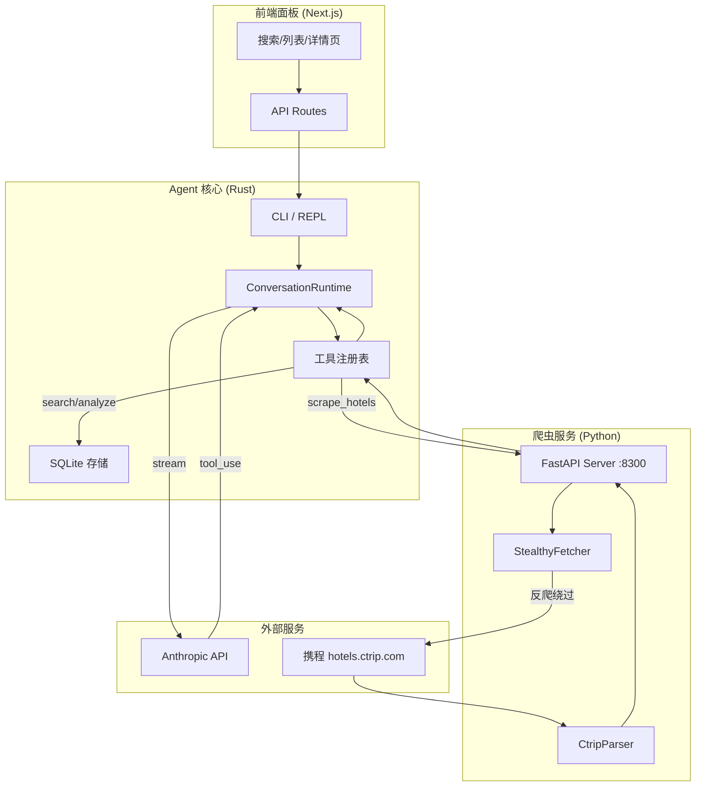
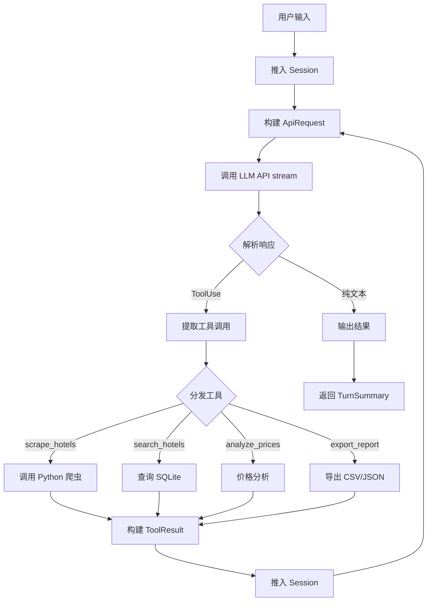
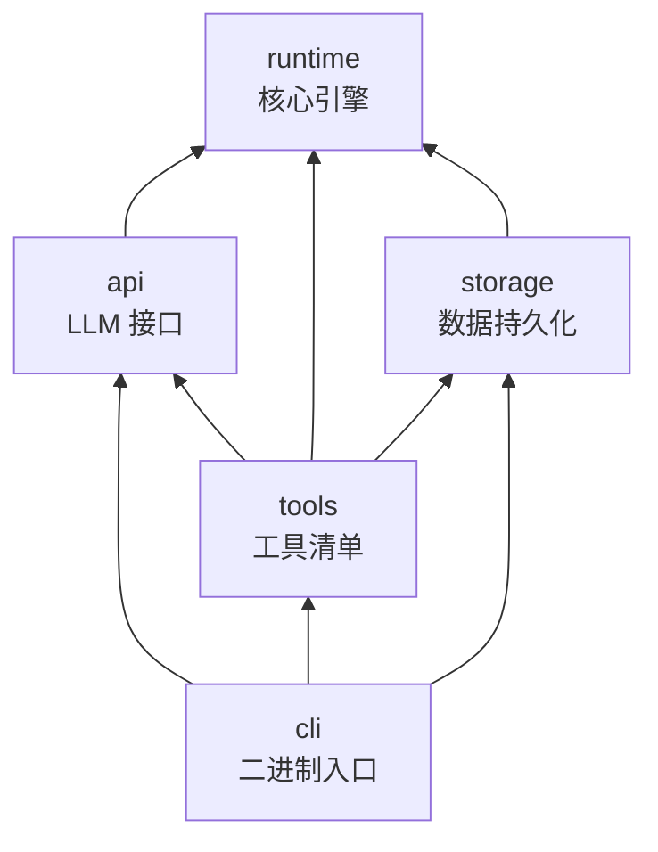
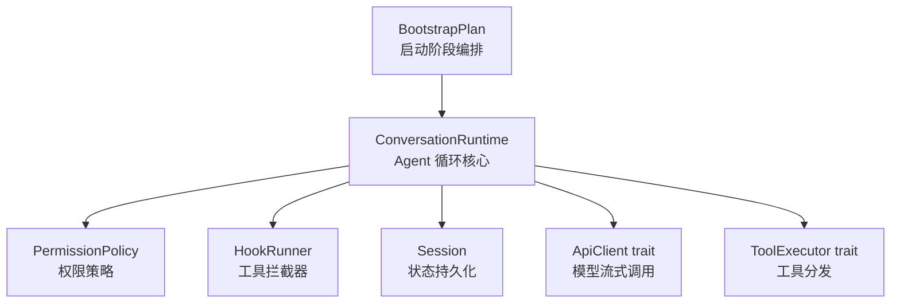
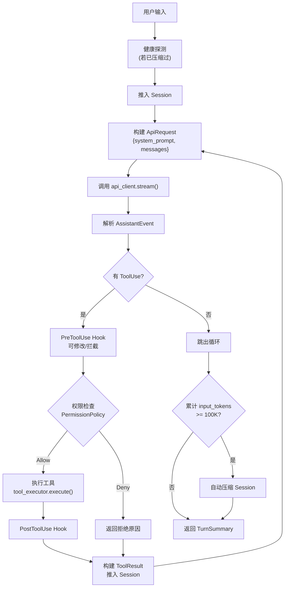
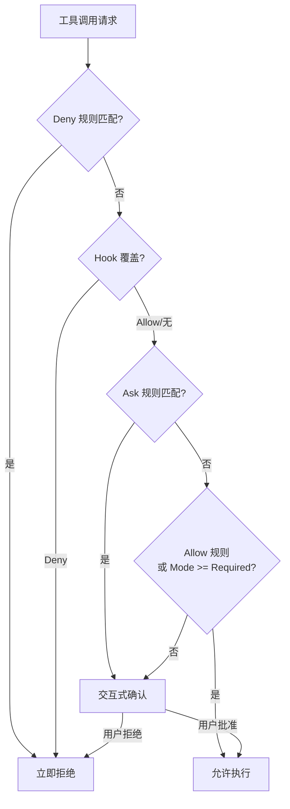
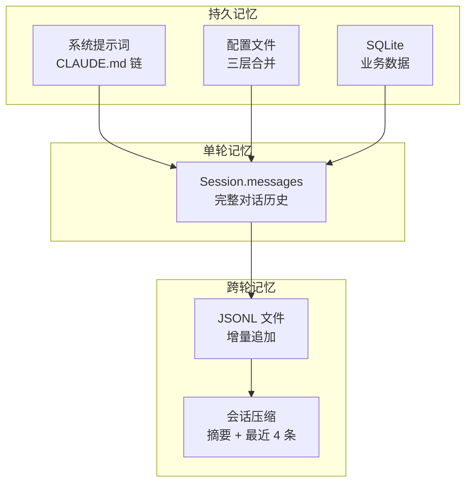
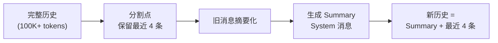
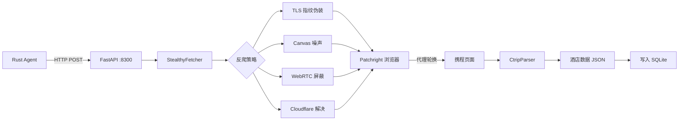
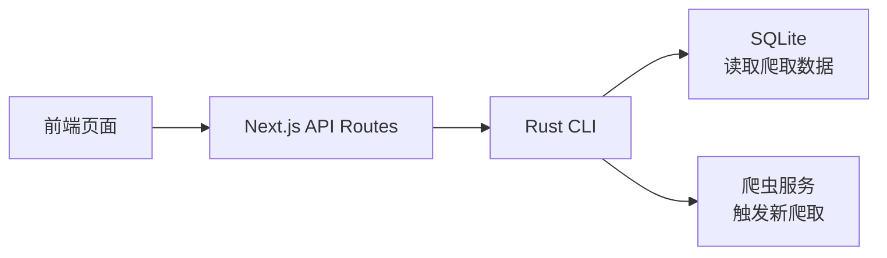

# CCTraveler — 项目架构文档

> AI Agent 驱动的酒店价格情报平台。
> 通过隐身浏览器自动化爬取携程酒店数据，由 Rust Agent 引擎编排任务流程。

---

## 1. 项目概述

CCTraveler 是一个 **Monorepo** 项目，包含三大核心模块：

1. **Agent 核心**（Rust）— 参考 [ultraworkers/claw-code](https://github.com/ultraworkers/claw-code) 架构，实现相同的 `ConversationRuntime<C: ApiClient, T: ToolExecutor>` 泛型 Agent 循环模式，负责任务编排和工具调用。
2. **爬虫服务**（Python）— 基于 [Scrapling](https://github.com/D4Vinci/Scrapling) 的隐身爬取微服务，处理携程的反爬机制（TLS 指纹、Cloudflare 绕过、浏览器自动化）。
3. **前端面板**（TypeScript/Next.js）— 酒店数据浏览、搜索和价格分析看板。

### 参考架构：claw-code

Rust Agent 核心采用了 `ultraworkers/claw-code` 的以下设计模式：

| claw-code 模式 | CCTraveler 采用方式 |
|---------------|-------------------|
| `ConversationRuntime<C: ApiClient, T: ToolExecutor>` — 泛型 Agent 循环 | 相同模式：通过 API 客户端 + 工具执行器 trait 参数化的泛型运行时 |
| `ToolSpec` + `GlobalToolRegistry` + match 分发 | 相同模式：4 个领域工具（爬取、搜索、分析、导出）通过 `ToolSpec` 注册 |
| `Session` JSONL 持久化 + 文件轮转 | 简化版：每个任务单独一个 JSONL 会话文件 |
| `ConfigLoader` 三层配置合并（用户 > 项目 > 本地） | 适配版：基于 TOML 的配置，使用工作区级默认值 |
| `SystemPromptBuilder` + 指令文件发现 | 适配版：针对酒店爬取领域的静态系统提示词 |
| `PermissionPolicy` + `PermissionPrompter` trait | 简化版：所有工具预授权，无需交互式权限确认 |
| Cargo workspace（9 个 crate） | 精简版：5 个 crate，聚焦爬取领域 |

### 为什么选择这个架构？

| 挑战 | 解决方案 |
|------|---------|
| 携程强反爬（TLS 指纹、Cloudflare Turnstile、动态渲染） | Scrapling 的 `StealthyFetcher` + Patchright + Canvas 噪声 + WebRTC 屏蔽 |
| 价格数据需要登录 | 浏览器 Session 持久化 + Cookie 管理 |
| 复杂的爬取流程（分页、重试、限流） | Rust Agent 通过 tool-use 模式编排任务 |
| 查看爬取数据 | Next.js 看板 + 搜索筛选 + 价格对比 |

---

## 2. Monorepo 目录结构

```
CCTraveler/
├── turbo.json                    # Turborepo 流水线配置
├── package.json                  # 根工作区配置 (pnpm)
├── pnpm-workspace.yaml           # pnpm 工作区定义
├── Cargo.toml                    # Rust workspace 根配置
├── Cargo.lock
│
├── crates/                       # ═══ Rust Agent 核心 ═══
│   ├── runtime/                  # 核心：会话循环、会话管理、配置、提示词
│   │   ├── Cargo.toml
│   │   └── src/
│   │       ├── lib.rs            # 公开导出
│   │       ├── conversation.rs   # ConversationRuntime<C,T> — Agent 循环
│   │       ├── session.rs        # Session 结构体，JSONL 持久化
│   │       ├── config.rs         # ConfigLoader，RuntimeConfig (TOML)
│   │       ├── prompt.rs         # SystemPromptBuilder 爬取领域系统提示词
│   │       └── types.rs          # ConversationMessage, ContentBlock, MessageRole
│   │
│   ├── api/                      # LLM 接口抽象层
│   │   ├── Cargo.toml
│   │   └── src/
│   │       ├── lib.rs
│   │       ├── client.rs         # ProviderClient 枚举 (Anthropic/OpenAI 兼容)
│   │       ├── types.rs          # MessageRequest, MessageResponse, ToolDefinition
│   │       ├── sse.rs            # SSE 帧解析器（流式响应）
│   │       └── providers/
│   │           ├── mod.rs        # Provider trait，ProviderKind 枚举
│   │           ├── anthropic.rs  # AnthropicClient（认证、流式、重试）
│   │           └── openai_compat.rs  # OpenAI/xAI 兼容客户端
│   │
│   ├── tools/                    # 工具定义与分发
│   │   ├── Cargo.toml
│   │   └── src/
│   │       ├── lib.rs            # ToolSpec, GlobalToolRegistry, execute_tool()
│   │       ├── scrape.rs         # scrape_hotels — 调用 Python 爬虫服务
│   │       ├── search.rs         # search_hotels — 查询本地 SQLite
│   │       ├── analyze.rs        # analyze_prices — 价格对比逻辑
│   │       └── export.rs         # export_report — CSV/JSON 导出
│   │
│   ├── storage/                  # 数据持久化层
│   │   ├── Cargo.toml
│   │   └── src/
│   │       ├── lib.rs
│   │       ├── db.rs             # SQLite 连接池
│   │       ├── models.rs         # Hotel, Room, PriceSnapshot (Rust 结构体)
│   │       └── queries.rs        # 查询构建器（插入、搜索、聚合）
│   │
│   └── cli/                      # CLI 二进制入口
│       ├── Cargo.toml
│       ├── build.rs              # 注入 GIT_SHA, BUILD_DATE
│       └── src/
│           ├── main.rs           # main(), CLI 参数解析, REPL
│           ├── render.rs         # 终端输出、加载动画、Markdown 渲染
│           └── input.rs          # LineEditor (rustyline 封装)
│
├── services/                     # ═══ Python 爬虫服务 ═══
│   └── scraper/
│       ├── pyproject.toml        # Python 项目配置 (uv/pip)
│       ├── requirements.txt
│       ├── src/
│       │   ├── __init__.py
│       │   ├── server.py         # FastAPI HTTP 服务 (端口 8300)
│       │   ├── ctrip/
│       │   │   ├── __init__.py
│       │   │   ├── fetcher.py    # 携程专用 StealthyFetcher 封装
│       │   │   ├── parser.py     # HTML → 结构化酒店数据
│       │   │   ├── session.py    # 浏览器 Session 持久化 + Cookie
│       │   │   └── types.py      # Pydantic 数据模型
│       │   ├── anti_detect/
│       │   │   ├── __init__.py
│       │   │   ├── fingerprint.py  # TLS/浏览器指纹轮换
│       │   │   └── proxy.py      # 代理池管理
│       │   └── utils/
│       │       ├── __init__.py
│       │       └── rate_limit.py # 请求限流
│       └── tests/
│           └── test_ctrip.py
│
├── packages/                     # ═══ 前端 & 共享包 ═══
│   ├── web/                      # Next.js 看板
│   │   ├── package.json
│   │   ├── next.config.ts
│   │   ├── tailwind.config.ts
│   │   ├── app/
│   │   │   ├── layout.tsx
│   │   │   ├── page.tsx          # 首页 — 搜索酒店
│   │   │   ├── hotels/
│   │   │   │   ├── page.tsx      # 酒店列表 + 筛选
│   │   │   │   └── [id]/
│   │   │   │       └── page.tsx  # 酒店详情 + 价格走势
│   │   │   └── api/
│   │   │       ├── hotels/
│   │   │       │   └── route.ts  # GET /api/hotels
│   │   │       ├── scrape/
│   │   │       │   └── route.ts  # POST /api/scrape (触发爬取)
│   │   │       └── prices/
│   │   │           └── route.ts  # GET /api/prices
│   │   └── components/
│   │       ├── hotel-card.tsx    # 酒店卡片
│   │       ├── price-chart.tsx   # 价格趋势图
│   │       ├── search-form.tsx   # 搜索表单
│   │       ├── filter-panel.tsx  # 筛选面板
│   │       └── data-table.tsx    # 数据表格
│   │
│   └── shared/                   # 共享 TypeScript 类型
│       ├── package.json
│       └── src/
│           └── types.ts          # Hotel, Room, Price 类型定义
│
├── docs/                         # ═══ 文档 ═══
│   ├── architecture.md           # 英文架构文档
│   ├── architecture-zh.md        # 中文架构文档（本文件）
│   ├── scraping-strategy.md      # 携程反爬绕过策略
│   └── api-reference.md          # 内部 API 参考
│
└── scripts/                      # ═══ 开发脚本 ═══
    ├── setup.sh                  # 安装所有依赖
    └── dev.sh                    # 启动所有服务
```

---

## 3. 系统架构图

### 3.0 整体系统架构



## 4. Rust 核心架构（源自 claw-code）

### 4.1 核心 Trait

遵循 claw-code 的 **trait 多态** 模式，实现可测试性：

```rust
/// API 客户端 trait — 抽象 LLM 提供商（Anthropic、OpenAI 等）
/// 同步接口；异步通过内部 tokio::Runtime 处理
pub trait ApiClient {
    fn stream(&mut self, request: ApiRequest) -> Result<Vec<AssistantEvent>, RuntimeError>;
}

/// 工具执行器 trait — 抽象工具分发
pub trait ToolExecutor {
    fn execute(&mut self, tool_name: &str, input: &str) -> Result<String, ToolError>;
}
```

生产实现：
- `AnthropicRuntimeClient` 实现 `ApiClient` — 封装 `ProviderClient` 枚举 + tokio 运行时
- `TravelerToolExecutor` 实现 `ToolExecutor` — 分发到 scrape/search/analyze/export 处理函数

测试实现：
- `MockApiClient` — 返回预设响应，用于确定性测试
- `MockToolExecutor` — 记录调用并返回预设结果

### 4.2 Agent 会话循环

`ConversationRuntime<C: ApiClient, T: ToolExecutor>` — 核心 Agent 循环，直接源自 claw-code 的 `conversation.rs`：



### 4.3 核心类型

```rust
/// 会话消息（用户、助手或工具结果）
pub struct ConversationMessage {
    pub role: MessageRole,           // System | User | Assistant | Tool
    pub content: Vec<ContentBlock>,
    pub usage: Option<TokenUsage>,
}

/// 消息内容块
pub enum ContentBlock {
    Text { text: String },
    ToolUse { id: String, name: String, input: Value },
    ToolResult { tool_use_id: String, tool_name: String, output: String, is_error: bool },
}

/// 会话状态，以 JSONL 格式持久化
pub struct Session {
    pub session_id: String,
    pub messages: Vec<ConversationMessage>,
    pub workspace_root: PathBuf,
    pub model: String,
    pub created_at: DateTime<Utc>,
}

/// 暴露给 LLM 的工具定义
pub struct ToolSpec {
    pub name: &'static str,
    pub description: &'static str,
    pub input_schema: Value,  // JSON Schema
}

/// 合并的工具注册表
pub struct GlobalToolRegistry {
    tools: Vec<ToolSpec>,
}
```

### 4.4 Crate 依赖关系图



| Crate | 职责 |
|-------|------|
| `runtime` | 核心引擎：`ConversationRuntime<C,T>`、会话持久化、配置加载、系统提示词构建、核心类型 |
| `api` | LLM 接口抽象：`ProviderClient` 枚举、SSE 流式传输、Anthropic + OpenAI 兼容客户端、重试逻辑 |
| `tools` | 工具清单：`ToolSpec` 定义、`GlobalToolRegistry`、`execute_tool()` match 分发到类型化处理函数 |
| `storage` | 数据层：通过 `rusqlite` 操作 SQLite、Hotel/Room/PriceSnapshot 模型、查询构建器 |
| `cli` | 二进制入口：通过 `clap` 解析 CLI 参数、REPL 模式、单次提示模式、终端渲染 |

### 4.5 Rust Workspace 配置

```toml
[workspace]
members = ["crates/*"]
resolver = "2"

[workspace.package]
version = "0.1.0"
edition = "2021"
license = "MIT"

[workspace.dependencies]
tokio = { version = "1", features = ["full"] }
serde = { version = "1", features = ["derive"] }
serde_json = "1"
reqwest = { version = "0.12", features = ["json", "rustls-tls"] }
rusqlite = { version = "0.32", features = ["bundled"] }
clap = { version = "4", features = ["derive"] }
tracing = "0.1"
tracing-subscriber = "0.3"
anyhow = "1"
chrono = { version = "0.4", features = ["serde"] }
uuid = { version = "1", features = ["v4", "serde"] }

[workspace.lints.rust]
unsafe_code = "forbid"

[workspace.lints.clippy]
all = { level = "warn", priority = -1 }
pedantic = { level = "warn", priority = -1 }
module_name_repetitions = "allow"
missing_panics_doc = "allow"
missing_errors_doc = "allow"
```

---

## 5. Harness 设计（源自 claw-code）

Harness（运行时线束）是 claw-code 的核心编排层，CCTraveler 从中采用关键模式。

### 5.1 Harness 组成

Harness 不是一个单一结构体，而是**分层组合**：



### 5.2 ConversationRuntime 核心结构

```rust
pub struct ConversationRuntime<C, T> {
    session: Session,                        // 会话状态
    api_client: C,                           // LLM 客户端 (泛型)
    tool_executor: T,                        // 工具执行器 (泛型)
    permission_policy: PermissionPolicy,     // 权限策略
    system_prompt: Vec<String>,              // 系统提示词片段
    max_iterations: usize,                   // 最大循环次数
    usage_tracker: UsageTracker,             // Token 用量追踪
    hook_runner: HookRunner,                 // Hook 拦截器
    auto_compaction_input_tokens_threshold: u32, // 自动压缩阈值 (默认 100K)
}
```

### 5.3 `run_turn()` 完整流程



### 5.4 Hook 系统

Hook 在三个生命周期点拦截工具执行：

| 事件 | 时机 | 能力 |
|------|------|------|
| `PreToolUse` | 工具执行前 | 修改输入、拒绝执行、覆盖权限 |
| `PostToolUse` | 工具执行成功后 | 注入反馈消息、拒绝结果 |
| `PostToolUseFailure` | 工具执行失败后 | 注入错误诊断 |

Hook 是 shell 脚本，通过环境变量接收上下文：
- `HOOK_TOOL_NAME` — 工具名称
- `HOOK_TOOL_INPUT` — JSON 输入
- `HOOK_TOOL_OUTPUT` — 执行结果（仅 Post 阶段）

返回值：
- 退出码 `0` = 允许，`2` = 拒绝
- JSON 输出可包含 `updatedInput`（修改输入）、`decision: "block"`（拒绝）

### 5.5 权限系统

两层权限模型：



CCTraveler 简化版：所有爬取工具预授权（无需交互确认），但保留 Deny 规则用于安全防护。

### 5.6 CCTraveler 对 Harness 的采用

| claw-code Harness 组件 | CCTraveler 采用 | 简化点 |
|----------------------|----------------|-------|
| `ConversationRuntime<C,T>` | 完整采用 | 无简化 |
| `BootstrapPlan` (12 phases) | 简化为 3 步：config → session → runtime | 去掉 MCP/daemon/template |
| `WorkerRegistry` 状态机 | 不采用 | 无多 worker 需求 |
| `HookRunner` | 保留预留接口 | 初期不实现 hook |
| `PermissionPolicy` | 简化为全允许 | 保留 deny 规则 |
| `Session` JSONL 持久化 | 完整采用 | 无旋转（文件较小） |
| 自动压缩 (100K tokens) | 完整采用 | 相同阈值 |

---

## 6. 上下文记忆系统（源自 claw-code）

### 6.1 记忆层次



### 6.2 会话状态 (Session)

```rust
pub struct Session {
    pub session_id: String,                     // "session-{timestamp}-{counter}"
    pub messages: Vec<ConversationMessage>,      // 完整对话历史
    pub compaction: Option<SessionCompaction>,   // 压缩元数据
    pub workspace_root: Option<PathBuf>,        // 工作区绑定
    pub prompt_history: Vec<SessionPromptEntry>, // 用户提示历史
    pub model: Option<String>,                  // 使用的模型
}
```

### 6.3 JSONL 持久化

每条消息增量追加到 JSONL 文件，格式如下：

```jsonl
{"type":"session_meta","session_id":"session-17...","version":1}
{"type":"message","message":{"role":"user","blocks":[{"type":"text","text":"搜索遵义酒店"}]}}
{"type":"message","message":{"role":"assistant","blocks":[{"type":"tool_use","id":"t1","name":"scrape_hotels","input":"{...}"}]}}
{"type":"message","message":{"role":"tool","blocks":[{"type":"tool_result","tool_use_id":"t1","output":"[{hotel1},{hotel2}]"}]}}
```

关键机制：
- **增量追加**：新消息直接 append，不重写整个文件
- **文件轮转**：超过 256KB 时轮转为 `.rot-{timestamp}.jsonl`，最多保留 3 个
- **原子写入**：完整快照使用 write-to-temp + rename 保证崩溃安全

### 6.4 会话压缩 (Compaction)

当 input tokens 超过阈值时触发自动压缩：



摘要内容包括：
- 消息统计（用户/助手/工具数量）
- 使用过的工具列表
- 最近 3 个用户请求
- 待处理任务推断（含 "todo"/"next"/"pending" 的消息）
- 关键文件引用（识别 .rs/.ts/.json/.md 等路径）
- 当前工作推断
- 完整时间线（角色 + 截断内容）

二次压缩：`SummaryCompressionBudget` 将摘要限制在 1200 字符 / 24 行内。

### 6.5 系统提示词组装

系统提示词 = 静态指令 + 动态上下文，按以下顺序组装：

```
1. 基础角色定义（"你是一个 AI Agent..."）
2. 系统规则（工具使用、权限、安全）
3. 任务执行指南
4. ─── 动态边界线 ───
5. 环境信息（模型、平台、日期、工作目录）
6. 项目上下文（git 状态、最近提交）
7. 指令文件链（CLAUDE.md 从 cwd 向上发现）
8. 运行时配置
```

指令文件发现：从 cwd 向根目录遍历，每个目录检查：
- `CLAUDE.md`、`CLAUDE.local.md`
- `.claw/CLAUDE.md`、`.claw/instructions.md`

单文件限制 4000 字符，总限制 12000 字符，按内容哈希去重。

### 6.6 CCTraveler 的上下文记忆设计

| 层级 | claw-code 实现 | CCTraveler 采用 |
|------|--------------|----------------|
| 单轮记忆 | `Session.messages` 全量传给 LLM | 相同 |
| 跨轮持久化 | JSONL + 轮转 | JSONL（无轮转，任务较短） |
| 自动压缩 | 100K tokens 触发 | 相同阈值 |
| 系统提示词 | 通用 Agent 指令 + CLAUDE.md 链 | 酒店爬取领域专用提示词 |
| 工作区隔离 | FNV-1a 哈希命名空间 | 相同 |
| 业务记忆 | 无（通用 Agent） | SQLite（酒店/价格历史） |

CCTraveler 的独特记忆：
- **价格快照历史**：每次爬取写入 `price_snapshots` 表，Agent 可查询历史价格趋势
- **爬取任务日志**：记录每次爬取的参数、结果数、耗时，用于优化策略
- **城市 ID 映射缓存**：首次查询后缓存城市名 → 携程 ID 映射

---

## 7. 爬虫服务（Python）

基于 **FastAPI** 的轻量微服务，封装 Scrapling 实现携程专用爬取：



### 携程爬取策略

1. **反检测**：使用 `StealthyFetcher`：
   - `hide_canvas=True` — 对抗 Canvas 指纹
   - `block_webrtc=True` — 防止 IP 泄露
   - `solve_cloudflare=True` — 自动解决 Turnstile 验证
   - TLS 指纹伪装（`impersonate='chrome'`）

2. **会话管理**：
   - 维护持久化浏览器配置文件 + Cookie
   - 每个会话轮换 User-Agent 和指纹
   - 使用代理池分发请求

3. **数据提取**：
   - 携程通过 JavaScript 渲染酒店列表（React SSR + 客户端水合）
   - 使用浏览器自动化等待动态内容加载
   - 解析酒店卡片：名称、星级、位置、用户评分、房型、价格
   - 通过 URL 参数 `page=N` 处理分页

4. **限流策略**：
   - 请求间随机延迟（2-5 秒）
   - 最大并发浏览器实例：3
   - 遇到 403/429 时退避重试

### API 接口

| 方法 | 路径 | 说明 |
|------|------|------|
| `POST` | `/scrape/hotels` | 爬取指定城市+日期的酒店列表 |
| `POST` | `/scrape/hotel/{id}` | 爬取单个酒店详情页 |
| `GET` | `/health` | 健康检查 |
| `GET` | `/sessions` | 列出活跃的浏览器会话 |

---

## 8. 前端面板（Next.js）

### 页面路由

| 路由 | 说明 |
|------|------|
| `/` | 搜索表单 — 选择城市、日期、筛选条件 |
| `/hotels` | 酒店列表 — 卡片展示名称、价格、评分、图片 |
| `/hotels/[id]` | 酒店详情 — 房型、价格走势图、设施信息 |

### 核心组件

- **SearchForm** — 城市自动补全、日期选择器、入住人数、星级筛选
- **HotelCard** — 紧凑型酒店预览卡片，含关键信息和最低价
- **PriceChart** — 价格趋势折线图（使用 Recharts）
- **FilterPanel** — 价格区间滑块、星级、距离、设施筛选
- **DataTable** — 可排序、分页的数据表格

### 数据流



---

## 9. 数据模型

### 酒店 (Hotel)

```rust
pub struct Hotel {
    pub id: String,              // 携程酒店 ID
    pub name: String,            // 酒店名称
    pub name_en: Option<String>, // 英文名称
    pub star: u8,                // 星级 1-5
    pub rating: f64,             // 用户评分 (0-5.0)
    pub rating_count: u32,       // 评价数量
    pub address: String,         // 地址
    pub latitude: f64,           // 纬度
    pub longitude: f64,          // 经度
    pub image_url: Option<String>, // 图片 URL
    pub amenities: Vec<String>,  // 设施列表
    pub city: String,            // 城市
    pub district: Option<String>, // 区域
    pub created_at: DateTime<Utc>,
    pub updated_at: DateTime<Utc>,
}
```

### 房型 (Room)

```rust
pub struct Room {
    pub id: String,
    pub hotel_id: String,
    pub name: String,            // "大床房", "双床房" 等
    pub bed_type: Option<String>, // 床型
    pub max_guests: u8,          // 最大入住人数
    pub area: Option<f64>,       // 面积（平方米）
    pub has_window: bool,        // 是否有窗
    pub has_breakfast: bool,     // 是否含早
    pub cancellation_policy: Option<String>, // 取消政策
}
```

### 价格快照 (PriceSnapshot)

```rust
pub struct PriceSnapshot {
    pub id: String,
    pub room_id: String,
    pub hotel_id: String,
    pub price: f64,              // 每晚价格（人民币）
    pub original_price: Option<f64>, // 折扣前价格
    pub checkin: NaiveDate,      // 入住日期
    pub checkout: NaiveDate,     // 退房日期
    pub scraped_at: DateTime<Utc>, // 爬取时间
    pub source: String,          // 数据来源 "ctrip"
}
```

### SQLite 建表语句

```sql
CREATE TABLE hotels (
    id TEXT PRIMARY KEY,
    name TEXT NOT NULL,
    name_en TEXT,
    star INTEGER,
    rating REAL,
    rating_count INTEGER,
    address TEXT,
    latitude REAL,
    longitude REAL,
    image_url TEXT,
    amenities TEXT,           -- JSON 数组
    city TEXT NOT NULL,
    district TEXT,
    created_at TEXT NOT NULL,
    updated_at TEXT NOT NULL
);

CREATE TABLE rooms (
    id TEXT PRIMARY KEY,
    hotel_id TEXT NOT NULL REFERENCES hotels(id),
    name TEXT NOT NULL,
    bed_type TEXT,
    max_guests INTEGER,
    area REAL,
    has_window BOOLEAN,
    has_breakfast BOOLEAN,
    cancellation_policy TEXT
);

CREATE TABLE price_snapshots (
    id TEXT PRIMARY KEY,
    room_id TEXT NOT NULL REFERENCES rooms(id),
    hotel_id TEXT NOT NULL REFERENCES hotels(id),
    price REAL NOT NULL,
    original_price REAL,
    checkin TEXT NOT NULL,
    checkout TEXT NOT NULL,
    scraped_at TEXT NOT NULL,
    source TEXT DEFAULT 'ctrip'
);

CREATE INDEX idx_prices_hotel ON price_snapshots(hotel_id);
CREATE INDEX idx_prices_date ON price_snapshots(checkin, checkout);
CREATE INDEX idx_prices_scraped ON price_snapshots(scraped_at);
CREATE INDEX idx_hotels_city ON hotels(city);
```

---

## 10. Agent 工具定义

遵循 claw-code 的 `ToolSpec` 模式 — 每个工具包含名称、描述、JSON Schema 输入和类型化执行函数：

### `scrape_hotels`（爬取酒店）

```json
{
    "name": "scrape_hotels",
    "description": "从携程爬取指定城市和日期范围的酒店列表。调用 Python 爬虫服务处理反爬绕过和浏览器自动化。",
    "input_schema": {
        "type": "object",
        "properties": {
            "city": { "type": "string", "description": "城市名称或携程城市 ID" },
            "checkin": { "type": "string", "description": "入住日期 (YYYY-MM-DD)" },
            "checkout": { "type": "string", "description": "退房日期 (YYYY-MM-DD)" },
            "max_pages": { "type": "integer", "description": "最大爬取页数（默认 5）" },
            "filters": {
                "type": "object",
                "properties": {
                    "min_star": { "type": "integer" },
                    "max_price": { "type": "number" },
                    "keywords": { "type": "string" }
                }
            }
        },
        "required": ["city", "checkin", "checkout"]
    }
}
```

### `search_hotels`（搜索酒店）

```json
{
    "name": "search_hotels",
    "description": "从本地 SQLite 数据库搜索已爬取的酒店数据。",
    "input_schema": {
        "type": "object",
        "properties": {
            "city": { "type": "string" },
            "min_price": { "type": "number" },
            "max_price": { "type": "number" },
            "min_star": { "type": "integer" },
            "min_rating": { "type": "number" },
            "sort_by": { "type": "string", "enum": ["price", "rating", "star"] },
            "limit": { "type": "integer" }
        }
    }
}
```

### `analyze_prices`（价格分析）

```json
{
    "name": "analyze_prices",
    "description": "分析价格趋势，跨多个快照对比酒店价格。",
    "input_schema": {
        "type": "object",
        "properties": {
            "hotel_ids": { "type": "array", "items": { "type": "string" } },
            "date_range": {
                "type": "object",
                "properties": {
                    "start": { "type": "string" },
                    "end": { "type": "string" }
                }
            },
            "comparison_type": { "type": "string", "enum": ["trend", "cheapest", "best_value"] }
        },
        "required": ["hotel_ids"]
    }
}
```

### `export_report`（导出报告）

```json
{
    "name": "export_report",
    "description": "将爬取数据导出为 CSV 或 JSON 文件。",
    "input_schema": {
        "type": "object",
        "properties": {
            "format": { "type": "string", "enum": ["csv", "json"] },
            "city": { "type": "string" },
            "checkin": { "type": "string" },
            "checkout": { "type": "string" }
        },
        "required": ["format"]
    }
}
```

---

## 11. 构建 & 开发流程

### 环境要求

- Rust 1.80+（含 `cargo`）
- Python 3.10+（含 `uv` 或 `pip`）
- Node.js 20+（含 `pnpm`）
- Chromium（由 Playwright/Patchright 安装）

### Turborepo 流水线

```json
{
    "$schema": "https://turbo.build/schema.json",
    "tasks": {
        "build": {
            "dependsOn": ["^build"],
            "outputs": ["dist/**", ".next/**", "target/**"]
        },
        "dev": {
            "cache": false,
            "persistent": true
        },
        "lint": {
            "dependsOn": ["^build"]
        },
        "test": {
            "dependsOn": ["build"]
        }
    }
}
```

### 常用命令

```bash
# 安装所有依赖
pnpm install                      # Node 依赖
cargo build --workspace           # Rust workspace
cd services/scraper && uv sync    # Python 依赖

# 开发模式（启动所有服务）
pnpm dev
# 等同于：
#   - cargo run -p cli              (Agent CLI)
#   - python services/scraper/src/server.py  (爬虫 :8300)
#   - next dev packages/web         (前端 :3000)

# 构建
pnpm build

# 代码检查
pnpm lint                         # ESLint (TS)
cargo clippy --workspace          # Clippy (Rust)
ruff check services/scraper       # Ruff (Python)

# 测试
cargo test --workspace            # Rust 测试
pytest services/scraper/tests     # Python 测试
```

---

## 12. 配置文件

### `config.toml`（Agent 配置）

```toml
[agent]
model = "claude-sonnet-4-20250514"   # LLM 模型
max_turns = 50                       # 最大对话轮次

[scraper]
base_url = "http://localhost:8300"   # 爬虫服务地址
timeout_secs = 120                   # 请求超时
max_retries = 3                      # 最大重试次数

[storage]
db_path = "data/cctraveler.db"       # SQLite 数据库路径

[ctrip]
default_city = "558"                 # 默认城市：遵义
default_adults = 1                   # 默认成人数
default_children = 0                 # 默认儿童数
request_delay_ms = 3000              # 请求间延迟（毫秒）
max_concurrent = 3                   # 最大并发数
proxy_pool = []                      # 代理池（可选）
```

---

## 13. 技术栈总览

| 层级 | 技术 | 用途 |
|------|------|------|
| Agent 运行时 | Rust (tokio, reqwest, clap, rustyline) | 任务编排、工具执行、REPL |
| LLM 接口 | Anthropic API (SSE 流式) | Agent 智能 |
| 爬虫 | Python (Scrapling, FastAPI, Patchright) | 隐身爬取 + 反爬绕过 |
| 存储 | SQLite (rusqlite) | 酒店 & 价格数据持久化 |
| 前端 | Next.js 15, Tailwind CSS, Recharts | 看板 UI |
| Monorepo | Turborepo + pnpm + Cargo workspace | 构建编排 |

---

## 14. 路线图

### 第一阶段 — MVP
- [ ] 项目脚手架（monorepo、配置文件、Cargo workspace）
- [ ] Python 爬虫服务 + 携程酒店列表解析
- [ ] Rust 存储层（SQLite）
- [ ] 基础 CLI：`scrape` 和 `search` 命令
- [ ] 最小前端：酒店列表页

### 第二阶段 — Agent 智能
- [ ] 完整 Agent 循环 (`ConversationRuntime<C,T>`) + LLM 集成
- [ ] 工具定义（爬取、搜索、分析、导出）
- [ ] REPL 模式 + 会话持久化
- [ ] 价格对比和趋势分析

### 第三阶段 — 生产强化
- [ ] 代理池管理
- [ ] 定时爬取（类 cron）
- [ ] 价格异动通知
- [ ] 多城市支持
- [ ] 酒店详情页爬取（房型级数据）

### 第四阶段 — 高级功能
- [ ] 价格预测（ML）
- [ ] 多源对比（携程 + 美团 + 飞猪）
- [ ] 移动端自适应看板
- [ ] 导出到主流旅行规划工具
