# CCTraveler — Project Architecture

> AI Agent-powered hotel price intelligence platform.
> Scrapes Ctrip hotel data via stealth browser automation, orchestrated by a Rust agent harness.

---

## 1. Overview

CCTraveler is a **monorepo** project that combines:

1. **Agent Core** (Rust) — An AI agent harness modeled after [ultraworkers/claw-code](https://github.com/ultraworkers/claw-code), implementing the same `ConversationRuntime<C: ApiClient, T: ToolExecutor>` pattern for task orchestration with tool-use agent loops.
2. **Scraper Service** (Python) — A [Scrapling](https://github.com/D4Vinci/Scrapling)-based stealth scraping microservice that handles Ctrip's anti-bot protections (TLS fingerprinting, Cloudflare bypass, browser automation).
3. **Web Frontend** (TypeScript/Next.js) — A dashboard to browse, search, and analyze scraped hotel data.

### Reference Architecture: claw-code

Our Rust agent core adopts the following patterns from `ultraworkers/claw-code`:

| claw-code Pattern | CCTraveler Adoption |
|-------------------|---------------------|
| `ConversationRuntime<C: ApiClient, T: ToolExecutor>` — generic agent loop | Same pattern: generic runtime parameterized over API client + tool executor traits |
| `ToolSpec` + `GlobalToolRegistry` + match-dispatch | Same pattern: 4 domain tools (scrape, search, analyze, export) registered via `ToolSpec` |
| `Session` JSONL persistence with rotation | Simplified: single JSONL session file per task |
| `ConfigLoader` 3-layer merge (User > Project > Local) | Adapted: TOML-based config with workspace-level defaults |
| `SystemPromptBuilder` with instruction file discovery | Adapted: static system prompt tailored for hotel scraping domain |
| `PermissionPolicy` + `PermissionPrompter` trait | Simplified: no permission prompting (all tools pre-authorized) |
| Cargo workspace with 9 crates | Scaled down: 5 crates focused on scraping domain |

### Why This Architecture?

| Challenge | Solution |
|-----------|----------|
| Ctrip's heavy anti-bot (TLS fingerprinting, Cloudflare Turnstile, dynamic rendering) | Scrapling's `StealthyFetcher` with Patchright + canvas noise + WebRTC blocking |
| Login wall for price data | Browser session persistence + cookie management |
| Complex scraping workflows (pagination, retries, rate limiting) | Rust agent orchestrates tasks with tool-use pattern |
| Viewing scraped data | Next.js dashboard with search, filter, and price comparison |

---

## 2. Monorepo Structure

```
CCTraveler/
├── turbo.json                    # Turborepo pipeline config
├── package.json                  # Root workspace config (pnpm)
├── pnpm-workspace.yaml           # pnpm workspace definition
├── Cargo.toml                    # Rust workspace root
├── Cargo.lock
│
├── crates/                       # ═══ Rust Agent Core ═══
│   ├── runtime/                  # Core: conversation loop, session, config, prompt
│   │   ├── Cargo.toml
│   │   └── src/
│   │       ├── lib.rs            # Public re-exports
│   │       ├── conversation.rs   # ConversationRuntime<C,T> — the agent loop
│   │       ├── session.rs        # Session struct, JSONL persistence
│   │       ├── config.rs         # ConfigLoader, RuntimeConfig (TOML)
│   │       ├── prompt.rs         # SystemPromptBuilder for scraping domain
│   │       └── types.rs          # ConversationMessage, ContentBlock, MessageRole
│   │
│   ├── api/                      # LLM provider abstraction
│   │   ├── Cargo.toml
│   │   └── src/
│   │       ├── lib.rs
│   │       ├── client.rs         # ProviderClient enum (Anthropic/OpenAI-compat)
│   │       ├── types.rs          # MessageRequest, MessageResponse, ToolDefinition
│   │       ├── sse.rs            # SSE frame parser for streaming
│   │       └── providers/
│   │           ├── mod.rs        # Provider trait, ProviderKind enum
│   │           ├── anthropic.rs  # AnthropicClient (AuthSource, streaming, retries)
│   │           └── openai_compat.rs  # OpenAI/xAI compatible client
│   │
│   ├── tools/                    # Tool definitions and dispatch
│   │   ├── Cargo.toml
│   │   └── src/
│   │       ├── lib.rs            # ToolSpec, GlobalToolRegistry, execute_tool()
│   │       ├── scrape.rs         # scrape_hotels — calls Python scraper service
│   │       ├── search.rs         # search_hotels — query local SQLite DB
│   │       ├── analyze.rs        # analyze_prices — price comparison logic
│   │       └── export.rs         # export_report — CSV/JSON output
│   │
│   ├── storage/                  # Data persistence layer
│   │   ├── Cargo.toml
│   │   └── src/
│   │       ├── lib.rs
│   │       ├── db.rs             # SQLite connection pool
│   │       ├── models.rs         # Hotel, Room, PriceSnapshot (Rust structs)
│   │       └── queries.rs        # Query builders (insert, search, aggregate)
│   │
│   └── cli/                      # CLI binary entry point
│       ├── Cargo.toml
│       ├── build.rs              # Injects GIT_SHA, BUILD_DATE
│       └── src/
│           ├── main.rs           # main(), CLI arg parsing, REPL
│           ├── render.rs         # Terminal output, spinner, markdown
│           └── input.rs          # LineEditor (rustyline wrapper)
│
├── services/                     # ═══ Python Scraper Service ═══
│   └── scraper/
│       ├── pyproject.toml        # Python project config (uv/pip)
│       ├── requirements.txt
│       ├── src/
│       │   ├── __init__.py
│       │   ├── server.py         # FastAPI HTTP service (port 8300)
│       │   ├── ctrip/
│       │   │   ├── __init__.py
│       │   │   ├── fetcher.py    # StealthyFetcher wrapper for Ctrip
│       │   │   ├── parser.py     # HTML → structured hotel data
│       │   │   ├── session.py    # Browser session persistence + cookies
│       │   │   └── types.py      # Pydantic models
│       │   ├── anti_detect/
│       │   │   ├── __init__.py
│       │   │   ├── fingerprint.py  # TLS/browser fingerprint rotation
│       │   │   └── proxy.py      # Proxy pool management
│       │   └── utils/
│       │       ├── __init__.py
│       │       └── rate_limit.py # Request throttling
│       └── tests/
│           └── test_ctrip.py
│
├── packages/                     # ═══ Frontend & Shared ═══
│   ├── web/                      # Next.js dashboard
│   │   ├── package.json
│   │   ├── next.config.ts
│   │   ├── tailwind.config.ts
│   │   ├── app/
│   │   │   ├── layout.tsx
│   │   │   ├── page.tsx          # Home — search hotels
│   │   │   ├── hotels/
│   │   │   │   ├── page.tsx      # Hotel list with filters
│   │   │   │   └── [id]/
│   │   │   │       └── page.tsx  # Hotel detail + price history
│   │   │   └── api/
│   │   │       ├── hotels/
│   │   │       │   └── route.ts  # GET /api/hotels
│   │   │       ├── scrape/
│   │   │       │   └── route.ts  # POST /api/scrape (trigger)
│   │   │       └── prices/
│   │   │           └── route.ts  # GET /api/prices
│   │   └── components/
│   │       ├── hotel-card.tsx
│   │       ├── price-chart.tsx
│   │       ├── search-form.tsx
│   │       ├── filter-panel.tsx
│   │       └── data-table.tsx
│   │
│   └── shared/                   # Shared TypeScript types
│       ├── package.json
│       └── src/
│           └── types.ts          # Hotel, Room, Price types (TS)
│
├── docs/                         # ═══ Documentation ═══
│   ├── architecture.md           # This file
│   ├── scraping-strategy.md      # Ctrip anti-bot bypass details
│   └── api-reference.md          # Internal API docs
│
└── scripts/                      # ═══ Dev Scripts ═══
    ├── setup.sh                  # Install all dependencies
    └── dev.sh                    # Start all services
```

---

## 3. Architecture Diagrams

### 3.0 System Architecture

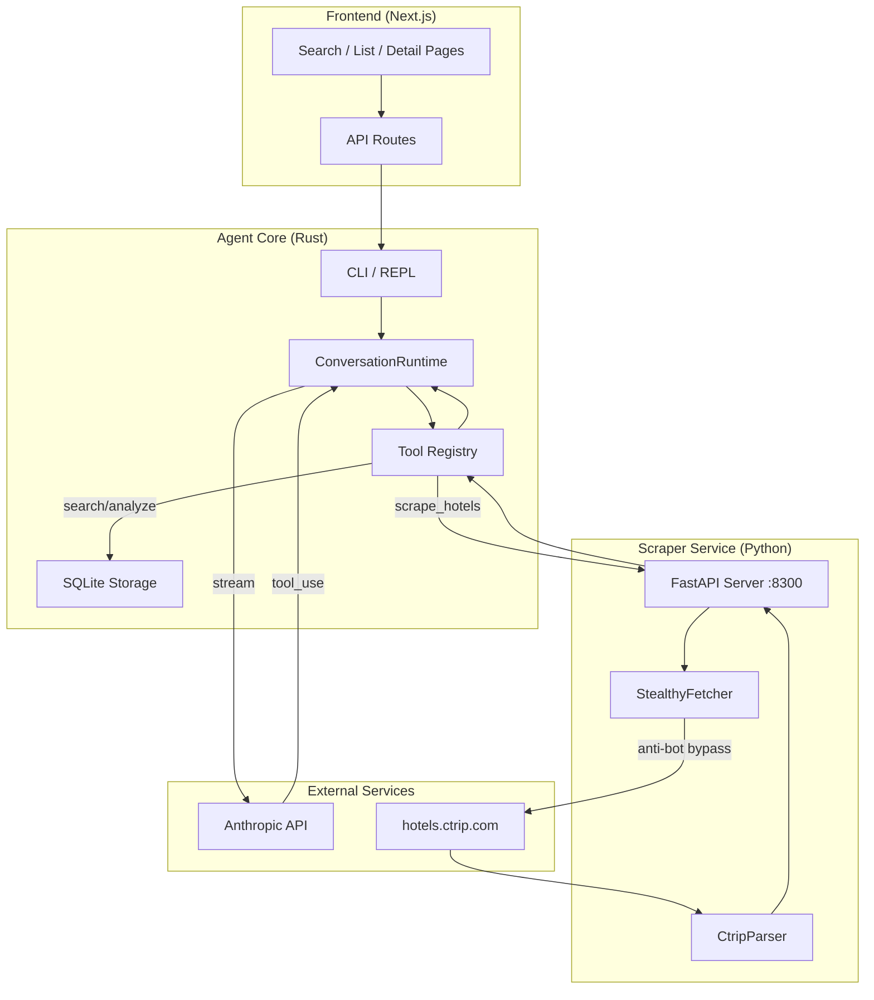

## 4. Core Rust Architecture (from claw-code)

### 4.1 Key Traits

Following claw-code's trait-based polymorphism pattern for testability:

```rust
/// API client trait — abstracts over LLM providers (Anthropic, OpenAI, etc.)
/// Synchronous interface; async is handled internally via tokio::Runtime.
pub trait ApiClient {
    fn stream(&mut self, request: ApiRequest) -> Result<Vec<AssistantEvent>, RuntimeError>;
}

/// Tool executor trait — abstracts over tool dispatch
pub trait ToolExecutor {
    fn execute(&mut self, tool_name: &str, input: &str) -> Result<String, ToolError>;
}
```

Production implementations:
- `AnthropicRuntimeClient` implements `ApiClient` — wraps `ProviderClient` enum + tokio runtime
- `TravelerToolExecutor` implements `ToolExecutor` — dispatches to scrape/search/analyze/export handlers

Test implementations:
- `MockApiClient` — returns scripted responses for deterministic testing
- `MockToolExecutor` — records calls and returns preset results

### 4.2 The Agent Conversation Loop

`ConversationRuntime<C: ApiClient, T: ToolExecutor>` — the core agent loop, directly adapted from claw-code's `conversation.rs`:

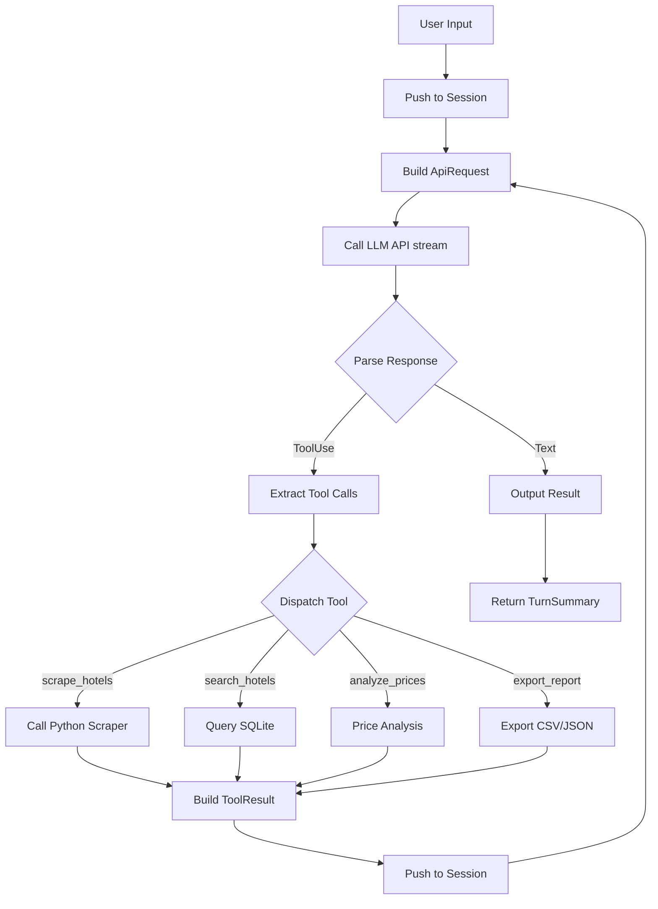

### 4.3 Core Types

```rust
/// A conversation message (user, assistant, or tool result)
pub struct ConversationMessage {
    pub role: MessageRole,           // System | User | Assistant | Tool
    pub content: Vec<ContentBlock>,
    pub usage: Option<TokenUsage>,
}

/// Content within a message
pub enum ContentBlock {
    Text { text: String },
    ToolUse { id: String, name: String, input: Value },
    ToolResult { tool_use_id: String, tool_name: String, output: String, is_error: bool },
}

/// Session state persisted as JSONL
pub struct Session {
    pub session_id: String,
    pub messages: Vec<ConversationMessage>,
    pub workspace_root: PathBuf,
    pub model: String,
    pub created_at: DateTime<Utc>,
}

/// Tool definition exposed to the LLM
pub struct ToolSpec {
    pub name: &'static str,
    pub description: &'static str,
    pub input_schema: Value,  // JSON Schema
}

/// Merged tool registry
pub struct GlobalToolRegistry {
    tools: Vec<ToolSpec>,
}
```

### 4.4 Crate Dependency Graph

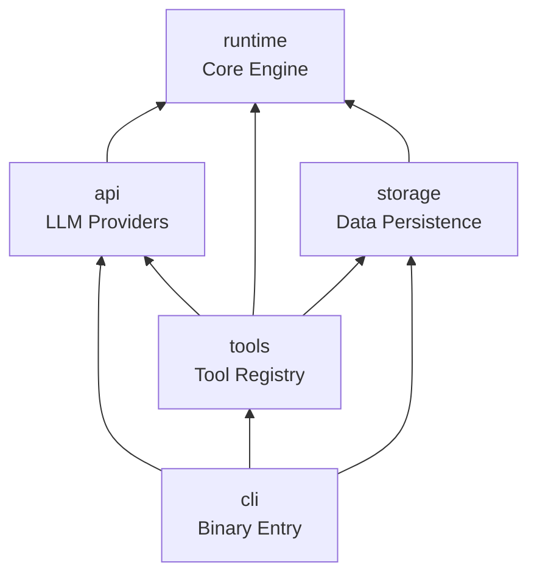

| Crate | Responsibility |
|-------|---------------|
| `runtime` | Core engine: `ConversationRuntime<C,T>`, session persistence, config loading, system prompt builder, core types (`ConversationMessage`, `ContentBlock`) |
| `api` | LLM provider abstraction: `ProviderClient` enum, SSE streaming, Anthropic + OpenAI-compat clients, retry logic |
| `tools` | Tool inventory: `ToolSpec` definitions, `GlobalToolRegistry`, `execute_tool()` match dispatch to typed handlers |
| `storage` | Data layer: SQLite via `rusqlite`, Hotel/Room/PriceSnapshot models, query builders |
| `cli` | Binary entry point: CLI arg parsing via `clap`, REPL mode, one-shot prompt mode, terminal rendering |

### 4.5 Rust Workspace Config

```toml
[workspace]
members = ["crates/*"]
resolver = "2"

[workspace.package]
version = "0.1.0"
edition = "2021"
license = "MIT"

[workspace.dependencies]
tokio = { version = "1", features = ["full"] }
serde = { version = "1", features = ["derive"] }
serde_json = "1"
reqwest = { version = "0.12", features = ["json", "rustls-tls"] }
rusqlite = { version = "0.32", features = ["bundled"] }
clap = { version = "4", features = ["derive"] }
tracing = "0.1"
tracing-subscriber = "0.3"
anyhow = "1"
chrono = { version = "0.4", features = ["serde"] }
uuid = { version = "1", features = ["v4", "serde"] }

[workspace.lints.rust]
unsafe_code = "forbid"

[workspace.lints.clippy]
all = { level = "warn", priority = -1 }
pedantic = { level = "warn", priority = -1 }
module_name_repetitions = "allow"
missing_panics_doc = "allow"
missing_errors_doc = "allow"
```

---

## 5. Harness Design (from claw-code)

The Harness (runtime harness) is claw-code's core orchestration layer. CCTraveler adopts its key patterns.

### 5.1 Harness Composition

The harness is not a single struct but a **layered composition**:

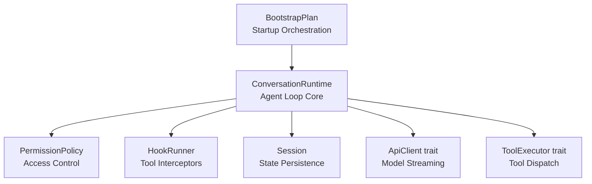

### 5.2 ConversationRuntime Core Struct

```rust
pub struct ConversationRuntime<C, T> {
    session: Session,                        // Session state
    api_client: C,                           // LLM client (generic)
    tool_executor: T,                        // Tool executor (generic)
    permission_policy: PermissionPolicy,     // Permission strategy
    system_prompt: Vec<String>,              // System prompt fragments
    max_iterations: usize,                   // Max loop iterations
    usage_tracker: UsageTracker,             // Token usage tracking
    hook_runner: HookRunner,                 // Hook interceptor
    auto_compaction_input_tokens_threshold: u32, // Auto-compaction threshold (default 100K)
}
```

### 5.3 `run_turn()` Complete Flow

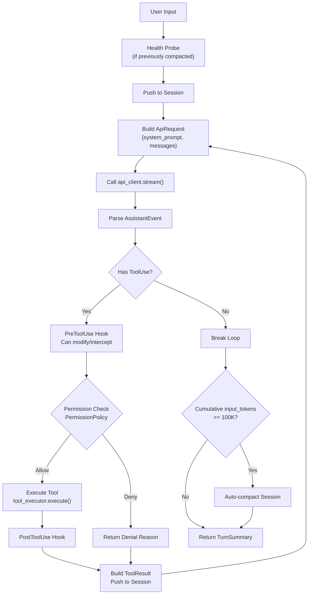

### 5.4 Hook System

Hooks intercept tool execution at three lifecycle points:

| Event | Timing | Capability |
|-------|--------|-----------|
| `PreToolUse` | Before tool execution | Modify input, deny execution, override permissions |
| `PostToolUse` | After successful execution | Inject feedback messages, deny results |
| `PostToolUseFailure` | After failed execution | Inject error diagnostics |

Hooks are shell scripts receiving context via environment variables:
- `HOOK_TOOL_NAME` — Tool name
- `HOOK_TOOL_INPUT` — JSON input
- `HOOK_TOOL_OUTPUT` — Execution result (Post hooks only)

Return values:
- Exit code `0` = allow, `2` = deny
- JSON output may contain `updatedInput` (modify input), `decision: "block"` (deny)

### 5.5 Permission System

Two-layer permission model:

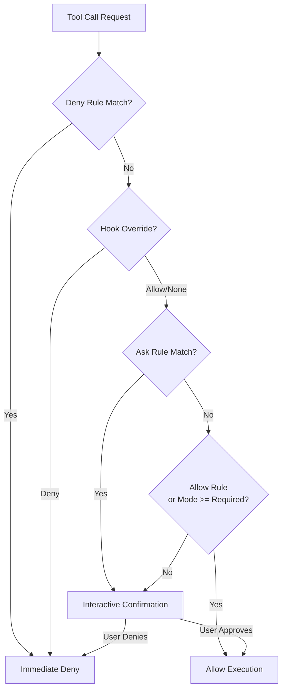

CCTraveler simplification: All scraping tools are pre-authorized (no interactive confirmation), but Deny rules are preserved for safety.

### 5.6 CCTraveler's Harness Adoption

| claw-code Harness Component | CCTraveler Adoption | Simplification |
|-----------------------------|---------------------|----------------|
| `ConversationRuntime<C,T>` | Full adoption | None |
| `BootstrapPlan` (12 phases) | Simplified to 3 steps: config → session → runtime | Removed MCP/daemon/template |
| `WorkerRegistry` state machine | Not adopted | No multi-worker needs |
| `HookRunner` | Interface reserved | Not implemented initially |
| `PermissionPolicy` | Simplified to allow-all | Deny rules preserved |
| `Session` JSONL persistence | Full adoption | No rotation (smaller files) |
| Auto-compaction (100K tokens) | Full adoption | Same threshold |

---

## 6. Context Memory System

> Combines claw-code session persistence + [Karpathy's LLM Wiki](https://gist.github.com/karpathy/442a6bf555914893e9891c11519de94f) knowledge management methodology.

### 6.1 Design Philosophy: LLM Wiki Methodology

Traditional agent context memory is **consumptive** — each conversation starts from scratch, relying on the context window to temporarily hold information, forgotten when the conversation ends. Karpathy's LLM Wiki proposes a **compound-interest knowledge accumulation** model:

> *"The tedious part of maintaining a knowledge base isn't reading or thinking — it's bookkeeping. LLMs excel at updating cross-references and maintaining consistency across distributed pages."*

Core idea: An LLM maintains a **persistent, interlinked Markdown knowledge base** where knowledge compounds over time, rather than re-deriving answers from raw sources on each query.

### 6.2 Four-Layer Memory Architecture

CCTraveler fuses claw-code's session persistence with LLM Wiki's knowledge sedimentation into a four-layer architecture:

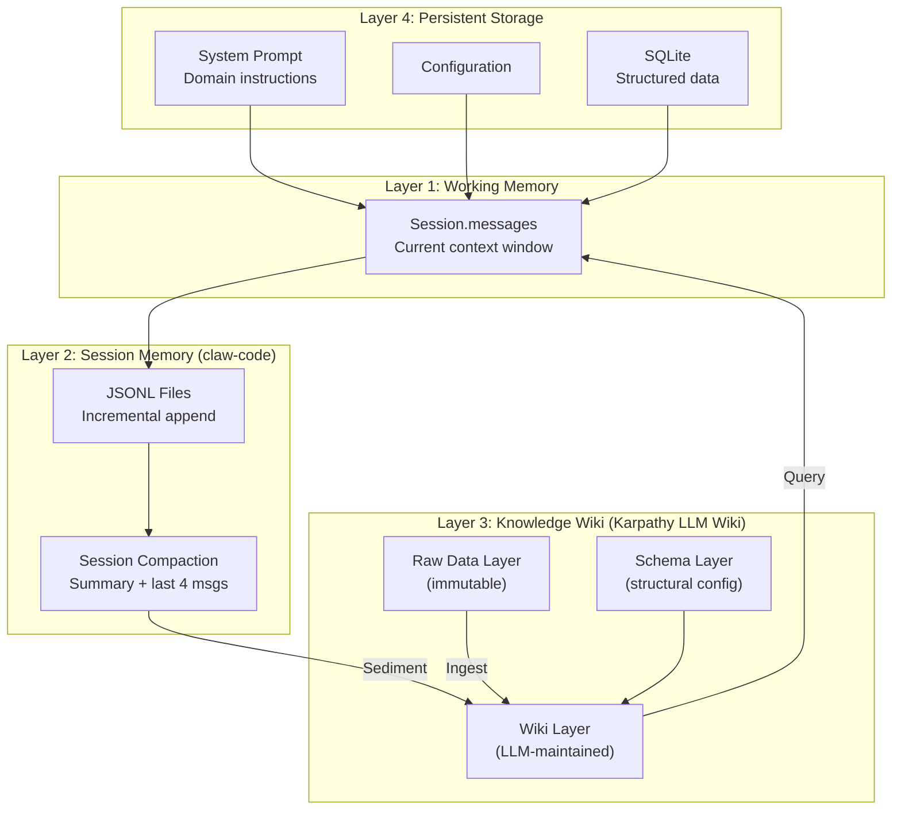

### 6.3 Layer 3 Deep Dive: Knowledge Wiki (LLM Wiki)

Drawing from Karpathy's three-layer knowledge system, CCTraveler implements **automatic knowledge sedimentation with cross-references**:

#### Three-Layer Structure

| Layer | Karpathy's Definition | CCTraveler Mapping | Storage |
|-------|----------------------|-------------------|---------|
| **Raw Data** | Immutable original documents | Ctrip HTML snapshots, raw API responses, scrape logs | `data/raw/` |
| **Wiki** | LLM-maintained Markdown pages | Hotel entity pages, city overviews, price trend pages | `data/wiki/` |
| **Schema** | Wiki structure & LLM workflow config | Page templates, cross-reference rules, lint rules | `data/wiki/.schema/` |

#### Wiki Directory Structure

```
data/wiki/
├── .schema/
│   ├── templates/              # Page templates
│   │   ├── hotel.md            # Hotel entity page template
│   │   ├── city.md             # City overview page template
│   │   └── trend.md            # Price trend page template
│   ├── rules.toml              # Lint rules & cross-reference conventions
│   └── ingest.toml             # Ingest workflow configuration
├── cities/
│   ├── zunyi.md                # Zunyi — overview, popular areas, best seasons
│   ├── chengdu.md
│   └── ...
├── hotels/
│   ├── 12345678.md             # Individual hotel entity page
│   ├── 87654321.md
│   └── ...
├── trends/
│   ├── zunyi-2026-04.md        # Monthly price trend analysis
│   └── ...
├── index.md                    # Global index (auto-maintained)
└── changelog.md                # Knowledge change log
```

#### Three Core Operations

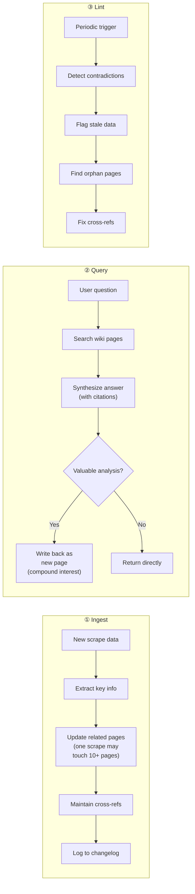

#### Ingest Example: How One Scrape Updates the Wiki

When the agent executes `scrape_hotels("Zunyi", "2026-05-01", "2026-05-03")`:

```
1. Write raw data → data/raw/zunyi-20260422T143000.json (immutable)

2. Update hotel entity pages:
   - data/wiki/hotels/12345678.md
     + Update "Latest Prices" section
     + Append price history row
     + Update "Data Freshness: 2026-04-22"

3. Update city overview page:
   - data/wiki/cities/zunyi.md
     + Update "Average Room Rate" stats
     + Refresh "Top 10 Hotels" ranking
     + Add "May Holiday Price Alert" paragraph

4. Update trend page:
   - data/wiki/trends/zunyi-2026-04.md
     + Append data point to trend table
     + Recalculate month-over-month change

5. Update index.md — new page links
6. Append changelog.md — "[2026-04-22] Ingest: Zunyi 42 hotels, 3 city pages updated"
```

#### Query Example: Knowledge Compound Interest

```
User: "Which hotel in Zunyi has the best value during the May holiday?"

Agent behavior:
1. Search wiki/cities/zunyi.md → get city overview
2. Search wiki/hotels/*.md → filter hotels with May holiday data
3. Search wiki/trends/zunyi-2026-04.md → get price trends
4. Synthesize analysis → generate recommendation

Key: If the analysis reveals an insight like "booking 2 weeks before
     May holiday is 30% cheaper than booking during the holiday",
     the agent **writes it back as a new page**:
     wiki/trends/zunyi-golden-week-pattern.md
     → Next similar query can reference it directly (compound interest)
```

#### Lint Rules

```toml
# data/wiki/.schema/rules.toml

[freshness]
max_age_days = 7              # Hotel pages older than 7 days marked stale
warn_age_days = 3             # Warning after 3 days

[consistency]
price_deviation_threshold = 0.5   # Same hotel price deviation >50% flagged
require_cross_refs = true         # Hotel pages must link to city pages

[cleanup]
remove_orphans = false            # Don't auto-delete orphan pages (flag for review)
max_changelog_entries = 500       # Archive changelog when limit exceeded
```

### 6.4 Layer 2 Deep Dive: Session Memory (from claw-code)

#### Session State

```rust
pub struct Session {
    pub session_id: String,                     // "session-{timestamp}-{counter}"
    pub messages: Vec<ConversationMessage>,      // Full conversation history
    pub compaction: Option<SessionCompaction>,   // Compaction metadata
    pub workspace_root: Option<PathBuf>,        // Workspace binding
    pub prompt_history: Vec<SessionPromptEntry>, // User prompt history
    pub model: Option<String>,                  // Model in use
}
```

#### JSONL Persistence

Each message is incrementally appended to a JSONL file:

```jsonl
{"type":"session_meta","session_id":"session-17...","version":1}
{"type":"message","message":{"role":"user","blocks":[{"type":"text","text":"Search Zunyi hotels"}]}}
{"type":"message","message":{"role":"assistant","blocks":[{"type":"tool_use","id":"t1","name":"scrape_hotels","input":"{...}"}]}}
{"type":"message","message":{"role":"tool","blocks":[{"type":"tool_result","tool_use_id":"t1","output":"[{hotel1},{hotel2}]"}]}}
```

Key mechanisms:
- **Incremental append**: New messages are appended directly, no file rewrite
- **File rotation**: Rotates to `.rot-{timestamp}.jsonl` when exceeding 256KB, max 3 rotated files
- **Atomic writes**: Full snapshots use write-to-temp + rename for crash safety

#### Session Compaction

Auto-compaction triggers when input tokens exceed threshold:

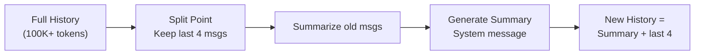

Summary contents include:
- Message statistics (user/assistant/tool counts)
- Tools used
- Last 3 user requests
- Pending task inference (messages containing "todo"/"next"/"pending")
- Key file references (.rs/.ts/.json/.md paths)
- Current work inference
- Full timeline (role + truncated content)

Secondary compression: `SummaryCompressionBudget` limits summaries to 1200 chars / 24 lines.

**Compaction → Wiki Sedimentation Bridge**: During compaction, valuable conversation insights are automatically ingested into the wiki layer:

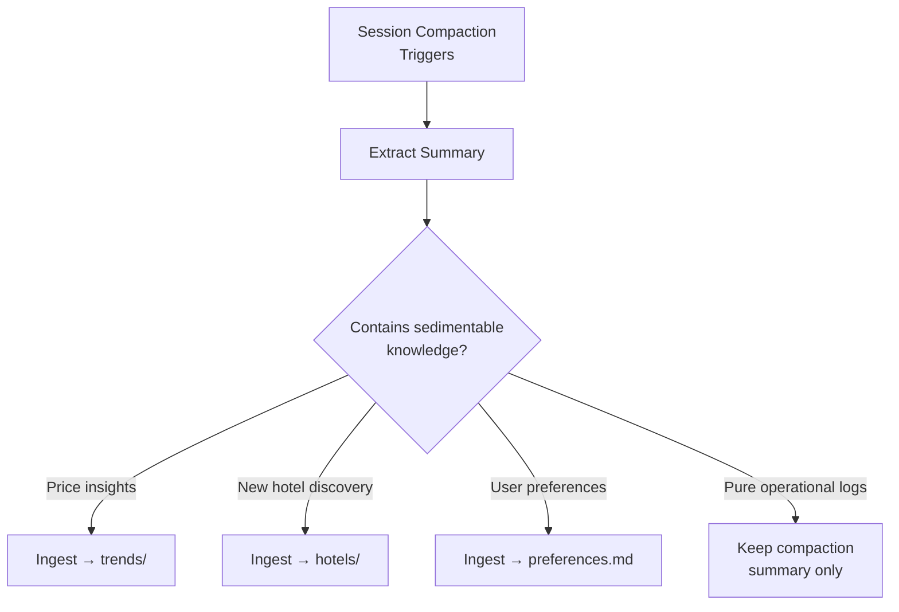

### 6.5 System Prompt Assembly

System prompt = static instructions + dynamic context + wiki summary, assembled in order:

```
1. Base role definition ("You are a hotel price intelligence AI Agent...")
2. System rules (tool usage, permissions, safety)
3. Task execution guidelines
4. ─── Dynamic boundary ───
5. Environment info (model, platform, date, working directory)
6. Project context (git status, recent commits)
7. Instruction file chain (CLAUDE.md discovered from cwd upward)
8. Wiki context summary (key stats from Wiki index.md)
9. Runtime configuration
```

Instruction file discovery: Traverse from cwd to root, checking each directory for:
- `CLAUDE.md`, `CLAUDE.local.md`
- `.claw/CLAUDE.md`, `.claw/instructions.md`

Single file limit: 4000 chars. Total limit: 12000 chars. Deduplicated by content hash.

### 6.6 CCTraveler Memory Design Overview

| Layer | Source | CCTraveler Implementation |
|-------|--------|--------------------------|
| Layer 1: Working Memory | claw-code | `Session.messages` — full context sent to LLM |
| Layer 2: Session Memory | claw-code | JSONL persistence + 100K token auto-compaction |
| Layer 3: Knowledge Wiki | Karpathy LLM Wiki | `data/wiki/` Markdown knowledge base (Ingest/Query/Lint) |
| Layer 4: Persistent Storage | CCTraveler-specific | SQLite structured data + config files |

**Knowledge Flow**:

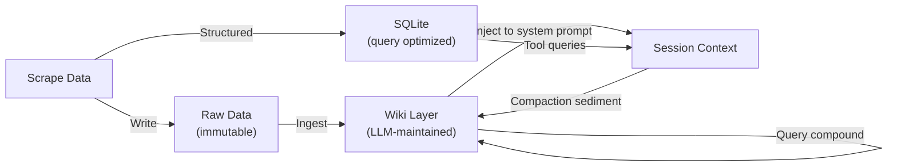

CCTraveler domain-specific memory:
- **Price snapshot history**: Each scrape writes to `price_snapshots` table (SQLite) + updates wiki trend pages
- **Scrape task logs**: Records parameters, result count, duration for strategy optimization
- **City ID mapping cache**: Caches city name → Ctrip ID mapping after first query
- **Knowledge compound interest**: Valuable analyses from user queries auto-written as wiki pages for future reference
- **Lint audits**: Periodic checks for stale prices, contradictory data, orphan pages to keep knowledge base healthy

---

## 7. Scraper Service (Python)

A lightweight **FastAPI** microservice that wraps Scrapling for Ctrip-specific scraping:

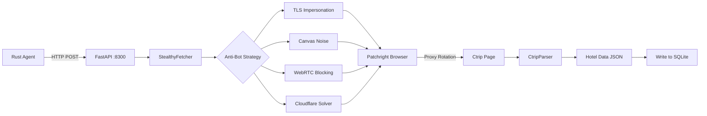

### Ctrip Scraping Strategy

1. **Anti-detection**: Use `StealthyFetcher` with:
   - `hide_canvas=True` — defeat canvas fingerprinting
   - `block_webrtc=True` — prevent IP leak
   - `solve_cloudflare=True` — auto-solve Turnstile challenges
   - TLS fingerprint impersonation (`impersonate='chrome'`)

2. **Session management**:
   - Maintain persistent browser profiles with cookies
   - Rotate user-agent and fingerprints per session
   - Use proxy pool to distribute requests

3. **Data extraction**:
   - Ctrip renders hotel list via JavaScript (React SSR + client hydration)
   - Use browser automation to wait for dynamic content
   - Parse hotel cards: name, star rating, location, user rating, room types, prices
   - Handle infinite scroll / pagination via URL parameter `page=N`

4. **Rate limiting**:
   - Random delay between requests (2-5 seconds)
   - Max concurrent browser instances: 3
   - Backoff on 403/429 responses

### API Endpoints

| Method | Path | Description |
|--------|------|-------------|
| `POST` | `/scrape/hotels` | Scrape hotel list for city + dates |
| `POST` | `/scrape/hotel/{id}` | Scrape single hotel detail page |
| `GET` | `/health` | Health check |
| `GET` | `/sessions` | List active browser sessions |

---

## 8. Web Frontend (Next.js)

### Pages

| Route | Description |
|-------|-------------|
| `/` | Search form — select city, dates, filters |
| `/hotels` | Hotel list — cards with name, price, rating, photo |
| `/hotels/[id]` | Hotel detail — room types, price history chart, amenities |

### Key Components

- **SearchForm** — City autocomplete, date picker, guest count, star filter
- **HotelCard** — Compact hotel preview with key info and lowest price
- **PriceChart** — Line chart showing price trends over time (recharts)
- **FilterPanel** — Price range slider, star rating, distance, amenities
- **DataTable** — Sortable, paginated table view of all scraped data

### Data Flow

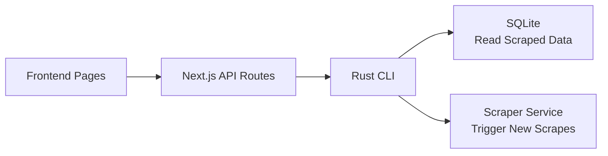

---

## 9. Data Model

### Hotel

```rust
pub struct Hotel {
    pub id: String,              // Ctrip hotel ID
    pub name: String,
    pub name_en: Option<String>,
    pub star: u8,                // 1-5
    pub rating: f64,             // User rating (0-5.0)
    pub rating_count: u32,
    pub address: String,
    pub latitude: f64,
    pub longitude: f64,
    pub image_url: Option<String>,
    pub amenities: Vec<String>,
    pub city: String,
    pub district: Option<String>,
    pub created_at: DateTime<Utc>,
    pub updated_at: DateTime<Utc>,
}
```

### Room

```rust
pub struct Room {
    pub id: String,
    pub hotel_id: String,
    pub name: String,            // "大床房", "双床房", etc.
    pub bed_type: Option<String>,
    pub max_guests: u8,
    pub area: Option<f64>,       // sqm
    pub has_window: bool,
    pub has_breakfast: bool,
    pub cancellation_policy: Option<String>,
}
```

### PriceSnapshot

```rust
pub struct PriceSnapshot {
    pub id: String,
    pub room_id: String,
    pub hotel_id: String,
    pub price: f64,              // CNY per night
    pub original_price: Option<f64>,
    pub checkin: NaiveDate,
    pub checkout: NaiveDate,
    pub scraped_at: DateTime<Utc>,
    pub source: String,          // "ctrip"
}
```

### SQLite Schema

```sql
CREATE TABLE hotels (
    id TEXT PRIMARY KEY,
    name TEXT NOT NULL,
    name_en TEXT,
    star INTEGER,
    rating REAL,
    rating_count INTEGER,
    address TEXT,
    latitude REAL,
    longitude REAL,
    image_url TEXT,
    amenities TEXT,           -- JSON array
    city TEXT NOT NULL,
    district TEXT,
    created_at TEXT NOT NULL,
    updated_at TEXT NOT NULL
);

CREATE TABLE rooms (
    id TEXT PRIMARY KEY,
    hotel_id TEXT NOT NULL REFERENCES hotels(id),
    name TEXT NOT NULL,
    bed_type TEXT,
    max_guests INTEGER,
    area REAL,
    has_window BOOLEAN,
    has_breakfast BOOLEAN,
    cancellation_policy TEXT
);

CREATE TABLE price_snapshots (
    id TEXT PRIMARY KEY,
    room_id TEXT NOT NULL REFERENCES rooms(id),
    hotel_id TEXT NOT NULL REFERENCES hotels(id),
    price REAL NOT NULL,
    original_price REAL,
    checkin TEXT NOT NULL,
    checkout TEXT NOT NULL,
    scraped_at TEXT NOT NULL,
    source TEXT DEFAULT 'ctrip'
);

CREATE INDEX idx_prices_hotel ON price_snapshots(hotel_id);
CREATE INDEX idx_prices_date ON price_snapshots(checkin, checkout);
CREATE INDEX idx_prices_scraped ON price_snapshots(scraped_at);
CREATE INDEX idx_hotels_city ON hotels(city);
```

---

## 10. Agent Tool Definitions

Following claw-code's `ToolSpec` pattern — each tool has name, description, JSON Schema, and a typed execute handler:

### `scrape_hotels`

```json
{
    "name": "scrape_hotels",
    "description": "Scrape hotel listings from Ctrip for a given city and date range. Calls the Python scraper service to handle anti-bot bypass and browser automation.",
    "input_schema": {
        "type": "object",
        "properties": {
            "city": { "type": "string", "description": "City name or Ctrip city ID" },
            "checkin": { "type": "string", "description": "Check-in date (YYYY-MM-DD)" },
            "checkout": { "type": "string", "description": "Check-out date (YYYY-MM-DD)" },
            "max_pages": { "type": "integer", "description": "Max pages to scrape (default 5)" },
            "filters": {
                "type": "object",
                "properties": {
                    "min_star": { "type": "integer" },
                    "max_price": { "type": "number" },
                    "keywords": { "type": "string" }
                }
            }
        },
        "required": ["city", "checkin", "checkout"]
    }
}
```

### `search_hotels`

```json
{
    "name": "search_hotels",
    "description": "Search previously scraped hotel data from local SQLite database.",
    "input_schema": {
        "type": "object",
        "properties": {
            "city": { "type": "string" },
            "min_price": { "type": "number" },
            "max_price": { "type": "number" },
            "min_star": { "type": "integer" },
            "min_rating": { "type": "number" },
            "sort_by": { "type": "string", "enum": ["price", "rating", "star"] },
            "limit": { "type": "integer" }
        }
    }
}
```

### `analyze_prices`

```json
{
    "name": "analyze_prices",
    "description": "Analyze price trends and compare hotels across multiple snapshots.",
    "input_schema": {
        "type": "object",
        "properties": {
            "hotel_ids": { "type": "array", "items": { "type": "string" } },
            "date_range": {
                "type": "object",
                "properties": {
                    "start": { "type": "string" },
                    "end": { "type": "string" }
                }
            },
            "comparison_type": { "type": "string", "enum": ["trend", "cheapest", "best_value"] }
        },
        "required": ["hotel_ids"]
    }
}
```

### `export_report`

```json
{
    "name": "export_report",
    "description": "Export scraped data as CSV or JSON file.",
    "input_schema": {
        "type": "object",
        "properties": {
            "format": { "type": "string", "enum": ["csv", "json"] },
            "city": { "type": "string" },
            "checkin": { "type": "string" },
            "checkout": { "type": "string" }
        },
        "required": ["format"]
    }
}
```

---

## 11. Build & Dev Workflow

### Prerequisites

- Rust 1.80+ (with `cargo`)
- Python 3.10+ (with `uv` or `pip`)
- Node.js 20+ (with `pnpm`)
- Chromium (installed by Playwright/Patchright)

### Turborepo Pipeline

```json
{
    "$schema": "https://turbo.build/schema.json",
    "tasks": {
        "build": {
            "dependsOn": ["^build"],
            "outputs": ["dist/**", ".next/**", "target/**"]
        },
        "dev": {
            "cache": false,
            "persistent": true
        },
        "lint": {
            "dependsOn": ["^build"]
        },
        "test": {
            "dependsOn": ["build"]
        }
    }
}
```

### Commands

```bash
# Install all dependencies
pnpm install                      # Node dependencies
cargo build --workspace           # Rust workspace
cd services/scraper && uv sync    # Python dependencies

# Development (starts all services)
pnpm dev
# Equivalent to:
#   - cargo run -p cli              (agent CLI)
#   - python services/scraper/src/server.py  (scraper on :8300)
#   - next dev packages/web         (frontend on :3000)

# Build
pnpm build

# Lint
pnpm lint                         # ESLint (TS)
cargo clippy --workspace          # Clippy (Rust)
ruff check services/scraper       # Ruff (Python)

# Test
cargo test --workspace            # Rust tests
pytest services/scraper/tests     # Python tests
```

---

## 12. Configuration

### `config.toml` (Agent)

```toml
[agent]
model = "claude-sonnet-4-20250514"
max_turns = 50

[scraper]
base_url = "http://localhost:8300"
timeout_secs = 120
max_retries = 3

[storage]
db_path = "data/cctraveler.db"

[ctrip]
default_city = "558"          # Zunyi
default_adults = 1
default_children = 0
request_delay_ms = 3000
max_concurrent = 3
proxy_pool = []               # Optional proxy list
```

---

## 13. Tech Stack Summary

| Layer | Technology | Purpose |
|-------|-----------|---------|
| Agent Runtime | Rust (tokio, reqwest, clap, rustyline) | Task orchestration, tool execution, REPL |
| LLM Provider | Anthropic API (SSE streaming) | Agent intelligence |
| Scraper | Python (Scrapling, FastAPI, Patchright) | Stealth web scraping with anti-bot bypass |
| Storage | SQLite (rusqlite) | Hotel & price data persistence |
| Frontend | Next.js 15, Tailwind CSS, Recharts | Dashboard UI |
| Monorepo | Turborepo + pnpm + Cargo workspace | Build orchestration |

---

## 14. Roadmap

### Phase 1 — MVP
- [ ] Project scaffolding (monorepo, configs, Cargo workspace)
- [ ] Python scraper service with Ctrip hotel list parsing
- [ ] Rust storage layer (SQLite)
- [ ] Basic CLI with `scrape` and `search` commands
- [ ] Minimal frontend with hotel list view

### Phase 2 — Agent Intelligence
- [ ] Full agent loop (`ConversationRuntime<C,T>`) with LLM integration
- [ ] Tool definitions (scrape, search, analyze, export)
- [ ] REPL mode with session persistence
- [ ] Price comparison and trend analysis

### Phase 3 — Production Hardening
- [ ] Proxy pool management
- [ ] Scheduled scraping (cron-like)
- [ ] Price alert notifications
- [ ] Multi-city support
- [ ] Hotel detail page scraping (room-level data)

### Phase 4 — Advanced Features
- [ ] Price prediction (ML)
- [ ] Multi-source comparison (Ctrip + Meituan + Fliggy)
- [ ] Mobile-responsive dashboard
- [ ] Export to popular travel planning tools

---

## 15. References

### Architecture & Design Patterns

| # | Reference | Description |
|---|-----------|-------------|
| 1 | [ultraworkers/claw-code](https://github.com/ultraworkers/claw-code) | Rust CLI agent harness — the primary architectural reference for CCTraveler's agent core (`ConversationRuntime<C,T>`, `ToolSpec`, session persistence, hook system) |
| 2 | [Karpathy's LLM Wiki](https://gist.github.com/karpathy/442a6bf555914893e9891c11519de94f) | LLM-maintained personal knowledge management — the methodology behind CCTraveler's Layer 3 knowledge wiki (Ingest/Query/Lint pattern) |
| 3 | [Vannevar Bush — "As We May Think" (1945)](https://www.theatlantic.com/magazine/archive/1945/07/as-we-may-think/303881/) | The original Memex concept — curated personal knowledge stores with associative connections, philosophical foundation for the LLM Wiki approach |

### Scraping & Anti-Bot

| # | Reference | Description |
|---|-----------|-------------|
| 4 | [D4Vinci/Scrapling](https://github.com/D4Vinci/Scrapling) | Python stealth scraping library with `StealthyFetcher` — TLS impersonation, canvas noise, Cloudflare bypass, WebRTC blocking |
| 5 | [Microsoft/Playwright](https://github.com/microsoft/playwright) | Browser automation framework — Scrapling's `StealthyFetcher` wraps Patchright (Playwright fork with stealth patches) |
| 6 | [Ctrip Hotels](https://hotels.ctrip.com/) | Target scraping site — China's largest OTA platform for hotel bookings |

### Tech Stack

| # | Reference | Description |
|---|-----------|-------------|
| 7 | [Rust Programming Language](https://www.rust-lang.org/) | Systems programming language for the agent core |
| 8 | [Tokio](https://tokio.rs/) | Async runtime for Rust — powers HTTP clients, SSE streaming, concurrent tool execution |
| 9 | [Anthropic Claude API](https://docs.anthropic.com/en/docs) | LLM provider for agent intelligence — SSE streaming, tool use, system prompts |
| 10 | [Next.js](https://nextjs.org/) | React framework for the frontend dashboard |
| 11 | [Turborepo](https://turbo.build/) | Monorepo build orchestration — manages Rust + Python + TypeScript build pipeline |
| 12 | [FastAPI](https://fastapi.tiangolo.com/) | Python async web framework for the scraper microservice |
| 13 | [SQLite / rusqlite](https://github.com/rusqlite/rusqlite) | Embedded database for hotel & price data persistence |
| 14 | [Recharts](https://recharts.org/) | React charting library for price trend visualization |
| 15 | [Tailwind CSS](https://tailwindcss.com/) | Utility-first CSS framework for the frontend |
| 16 | [Clap](https://github.com/clap-rs/clap) | Rust CLI argument parser for the agent binary |
| 17 | [Rustyline](https://github.com/kkawakam/rustyline) | Readline implementation for the REPL interface |
