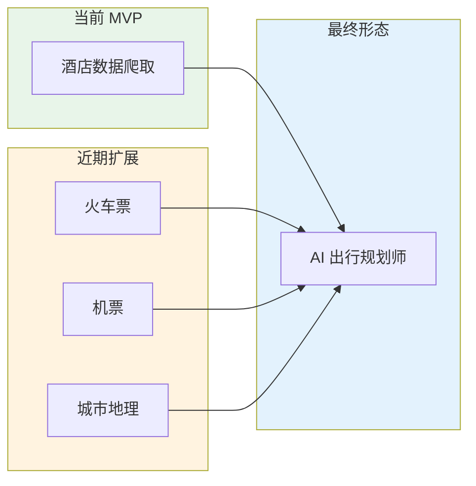
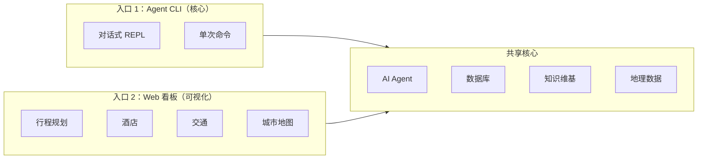
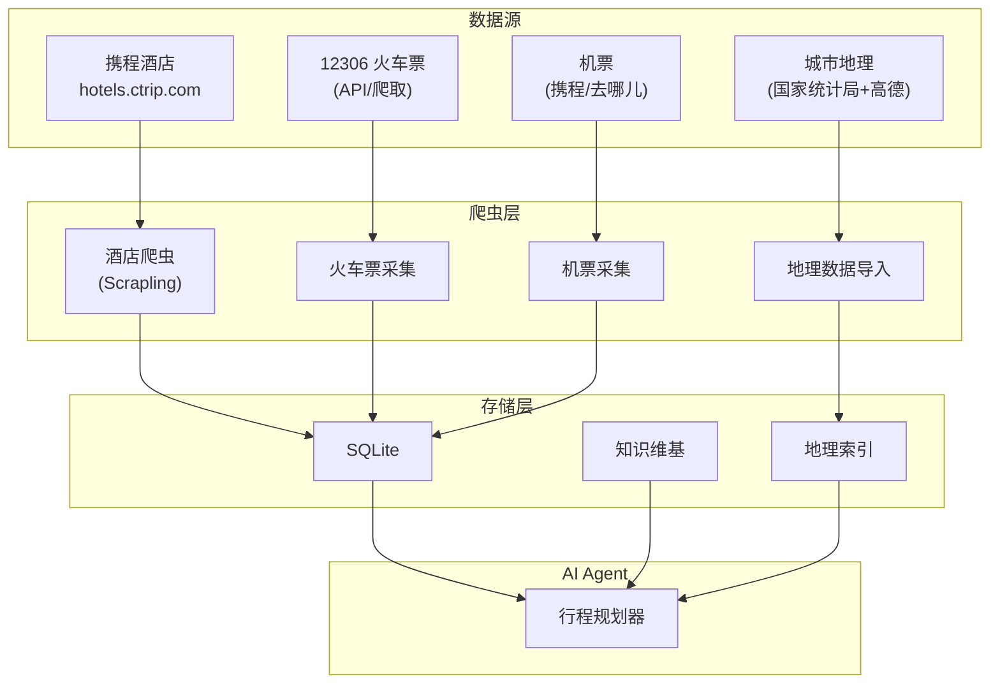
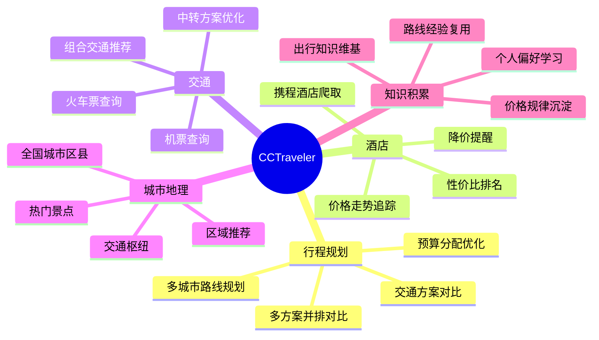
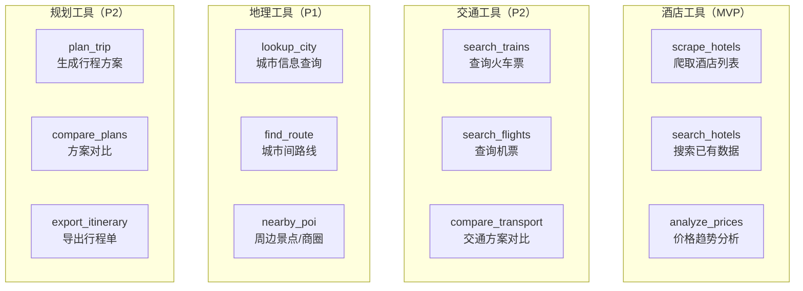
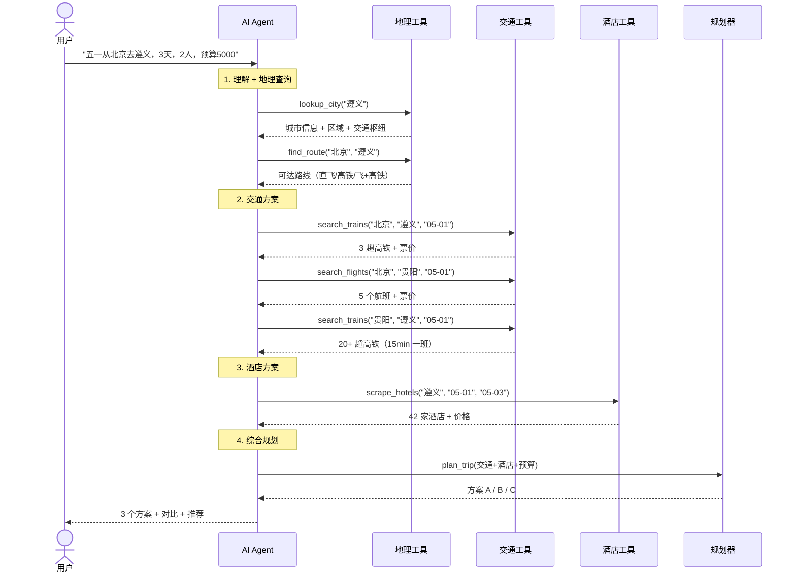
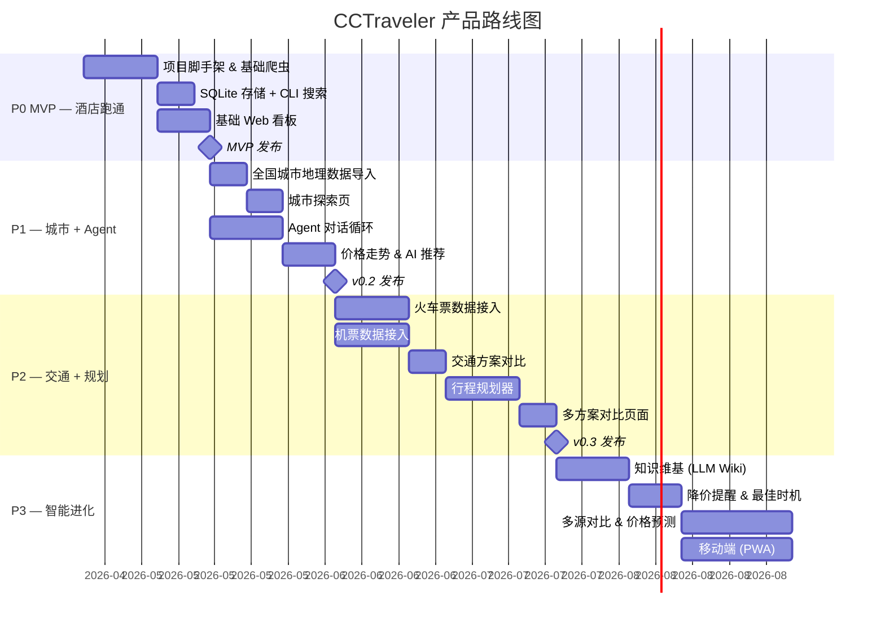

# CCTraveler — 产品设计文档

> 你的 AI 出行规划师：规划行程、比选路线、追踪价格，给你最优出行方案。

---

## 1. 产品定位

CCTraveler 是一个 **AI 驱动的全链路出行规划平台**。它不只是查酒店——而是像你的私人旅行顾问一样，综合酒店、机票、火车、城市地理信息，自动规划完整行程，给出最优路线和方案。

### 一句话定义

> **"用 AI 帮你规划行程，找到最合适的路线和方案，像股票分析师一样给你出旅行建议。"**

### 产品愿景



### 核心价值

| 痛点 | CCTraveler 解决方案 |
|------|-------------------|
| 规划一次出行要在 3-5 个 App 间来回跳 | 一个对话窗口搞定：酒店 + 交通 + 路线 |
| 不知道先飞再高铁还是直接火车划算 | AI 自动比较多种交通组合，给出最优路线 |
| 手动比价几十家酒店 + 几十趟班次太累 | 全自动爬取 + 智能筛选 + 性价比排名 |
| 不知道什么时候订最便宜 | 价格追踪 + 趋势分析 + 最佳预订时机建议 |
| 每次出行都从零开始研究 | 知识维基积累出行智慧，越用越懂你 |
| 不了解目的地城市的区域分布 | 全国城市区县地理数据 + 热门区域推荐 |

---

## 2. 目标用户

### 主要用户画像

```
主力用户：国内自由行旅行者
- 年龄：25-40 岁
- 场景：周末游 / 小长假 / 年假旅行
- 行为：提前 1-4 周规划，需要同时搞定交通+住宿
- 痛点：信息碎片化，多平台比价耗时，不确定最优方案
```

### 使用场景

| 场景 | 用户需求 | CCTraveler 价值 |
|------|---------|----------------|
| **从零规划** | "五一想去贵州玩 5 天，帮我规划行程" | 生成完整行程：路线 + 交通 + 酒店 + 预算 |
| **交通比选** | "北京到遵义，飞机还是高铁划算？" | 自动查机票 + 火车票，综合时间/价格/舒适度对比 |
| **住宿选择** | "遵义市区哪个区域住最方便？" | 城市地理 + 热门区域 + 酒店推荐 |
| **价格观望** | "帮我盯着这个航班，降价了提醒我" | 机票/酒店价格追踪 + 降价提醒 |
| **方案对比** | "方案 A 高铁直达 vs 方案 B 飞到贵阳转车，哪个好？" | 多方案并排对比：时间、费用、舒适度打分 |
| **积累复用** | "上次去遵义住的那家酒店叫什么？" | 知识维基自动记录，下次直接调用 |

---

## 3. 产品形态

### 3.1 双入口设计



**CLI（Agent REPL）** — 对话式交互，全链路规划：

```
$ cctraveler
CCTraveler v0.1.0 — AI Travel Planner

> 五一从北京去遵义玩 3 天，2 个人，预算 3000

正在规划行程...

===== 交通方案对比 =====

方案 A：高铁直达
  北京西 → 遵义 | G81 | 7h42min | ¥856/人
  总交通费：¥3,424（往返 2 人）

方案 B：飞机 + 高铁
  北京首都 → 贵阳龙洞堡 | CZ3682 | 3h10min | ¥680/人
  贵阳北 → 遵义 | G2993 | 1h02min | ¥89/人
  总交通费：¥3,076（往返 2 人）

推荐方案 B — 省 ¥348，总耗时仅多 30min（含中转）

===== 酒店推荐（剩余预算 ¥924，2 晚）=====

1. 遵义美居酒店 | 大床房 ¥258/晚 | 4.6分
   汇川区 · 距遵义会议旧址 1.2km
   2 晚合计 ¥516

建议：选方案 B + 美居酒店，总费用 ¥3,592
     略超预算 ¥592，但性价比最优。
     如需压缩，可选维也纳酒店（¥219/晚），总费用 ¥3,514。

> 方案 B 不错，再帮我看看遵义市区怎么玩

正在查询遵义城市数据...

遵义市区 3 天推荐路线：
Day 1: 遵义会议旧址 → 红军街 → 捞沙巷美食街
Day 2: 海龙屯世界遗产 → 湘江河畔
Day 3: 茅台镇（仁怀市，车程 2h）→ 返程
```

**Web 看板** — 可视化行程规划：

### 3.2 Web 看板页面设计

#### 首页 — AI 行程规划

```
+------------------------------------------------------+
|  CCTraveler                              [我的行程]   |
|                                                      |
|  +------------------------------------------------+  |
|  |                                                |  |
|  |  想去哪里？告诉我你的出行计划                    |  |
|  |                                                |  |
|  |  "五一从北京去贵州，2人，预算5000"               |  |
|  |                                                |  |
|  |              [ AI 规划行程 ]                    |  |
|  +------------------------------------------------+  |
|                                                      |
|  --- 或者分别查询 ---                                 |
|                                                      |
|  [酒店搜索]    [机票查询]    [火车票查询]             |
|                                                      |
|  --- 热门目的地 ---                                   |
|  +----------+ +----------+ +----------+ +----------+ |
|  | 成都     | | 大理     | | 西安     | | 遵义     | |
|  | 均价¥320 | | 均价¥280 | | 均价¥350 | | 均价¥240 | |
|  +----------+ +----------+ +----------+ +----------+ |
|                                                      |
|  --- AI 洞察 ---                                     |
|  "五一热门城市酒店均价较平日上涨 25-40%，             |
|   但提前 2 周预订可节省约 20%。建议本周下单。"         |
+------------------------------------------------------+
```

#### 行程方案页 — 多方案对比

```
+------------------------------------------------------+
|  北京 → 遵义 · 5/1-5/3 · 2人 · 预算 ¥3000           |
|                                                      |
|  +------------------------+ +------------------------+|
|  | 方案 A（推荐）          | | 方案 B                 ||
|  |                        | |                        ||
|  | 去程：飞机+高铁         | | 去程：高铁直达          ||
|  | CZ3682 北京→贵阳 3h10m | | G81 北京西→遵义 7h42m  ||
|  | G2993 贵阳→遵义 1h02m  | |                        ||
|  |                        | |                        ||
|  | 回程：高铁直达          | | 回程：高铁直达          ||
|  | G82 遵义→北京 7h45m    | | G82 遵义→北京 7h45m    ||
|  |                        | |                        ||
|  | 住宿：遵义美居 2晚      | | 住宿：维也纳 2晚       ||
|  | ¥258/晚               | | ¥219/晚               ||
|  |                        | |                        ||
|  | 交通 ¥3,076            | | 交通 ¥3,424            ||
|  | 住宿 ¥516              | | 住宿 ¥438              ||
|  | -----                  | | -----                  ||
|  | 总计 ¥3,592            | | 总计 ¥3,862            ||
|  | 总耗时 12h             | | 总耗时 15h30m          ||
|  |                        | |                        ||
|  | [选择此方案]            | | [选择此方案]            ||
|  +------------------------+ +------------------------+|
|                                                      |
|  --- 费用构成 ---                                     |
|  [饼图：交通 72% / 住宿 28%]                          |
|                                                      |
|  --- AI 分析 ---                                      |
|  "方案 A 虽然多一次中转，但节省 ¥270 且快 3.5h。     |
|   贵阳→遵义高铁班次密集（15min一班），衔接无压力。"     |
+------------------------------------------------------+
```

#### 酒店列表 — 筛选与对比

```
+------------------------------------------------------+
|  遵义 · 5/1-5/3 · 42家酒店                            |
|                                                      |
|  筛选：[¥100-300] [4星+] [含早餐] [距离排序]          |
|                                                      |
|  +--------------------------------------------------+|
|  | [img]  遵义美居酒店                      ¥258/晚  ||
|  |        4星 · 4.6分 · 2,340评                      ||
|  |        汇川区 · 距遵义会议旧址 1.2km               ||
|  |        含早 · 免费取消 · 有窗                      ||
|  |        较上周降价 12%                              ||
|  |        [查看详情]  [加入方案]  [追踪价格]           ||
|  +--------------------------------------------------+|
|  +--------------------------------------------------+|
|  | [img]  维也纳酒店(高铁站店)              ¥219/晚  ||
|  |        3星 · 4.5分 · 1,876评                      ||
|  |        播州区 · 距高铁站 500m                      ||
|  |        含早 · 免费WiFi                             ||
|  |        价格稳定                                    ||
|  |        [查看详情]  [加入方案]  [追踪价格]           ||
|  +--------------------------------------------------+|
+------------------------------------------------------+
```

#### 城市探索页 — 地理 + 区域

```
+------------------------------------------------------+
|  遵义市 · 城市概览                                     |
|                                                      |
|  +---------------------------+  +-------------------+|
|  |                           |  | 热门区域          ||
|  |      [城市区域地图]        |  |                   ||
|  |                           |  | 汇川区  核心商圈  ||
|  |   红花岗区  汇川区         |  | 酒店均价 ¥280    ||
|  |      播州区                |  |                   ||
|  |         仁怀市(茅台)       |  | 红花岗区 老城区   ||
|  |                           |  | 酒店均价 ¥220    ||
|  +---------------------------+  |                   ||
|                                 | 播州区  高铁新区  ||
|  --- 交通枢纽 ---                | 酒店均价 ¥190    ||
|  遵义站（高铁）                  +-------------------+|
|  遵义新舟机场                                        |
|  遵义茅台机场                                        |
|                                                      |
|  --- 热门景点 ---                                     |
|  遵义会议旧址(5A) · 海龙屯(世遗) · 赤水丹霞          |
|  茅台镇 · 湄潭茶海 · 娄山关                          |
|                                                      |
|  --- 到达方式 ---                                     |
|  从北京：高铁 7h42m / 飞机 3h10m(经贵阳)             |
|  从上海：高铁 9h / 飞机 3h30m(经贵阳)                |
|  从成都：高铁 2h46m（推荐）                           |
+------------------------------------------------------+
```

---

## 4. 数据层全景

### 4.1 四大数据源



### 4.2 数据模型概览

| 数据域 | 核心实体 | 来源 | 阶段 |
|--------|---------|------|------|
| **酒店** | Hotel, Room, PriceSnapshot | 携程 | MVP |
| **火车** | TrainRoute, TrainSchedule, TrainPrice | 12306 | P2 |
| **机票** | Flight, FlightPrice, Airline | 携程/去哪儿 | P2 |
| **城市** | City, District, Station, Airport, POI | 统计局/高德 | P1 |
| **行程** | Trip, Itinerary, Segment | Agent 生成 | P1 |

### 4.3 城市地理数据（全国覆盖）

```
cities/
├── provinces.json          # 34 个省级行政区
├── cities.json             # 337 个地级市
├── districts.json          # 2,844 个区县
├── stations/               # 火车站
│   ├── high_speed.json     # 高铁站（含经纬度）
│   └── regular.json        # 普通火车站
├── airports/               # 民航机场
│   └── airports.json       # 含 IATA 代码、经纬度
└── poi/                    # 热门景点 / 商圈
    ├── scenic.json         # 5A/4A 景区
    └── business.json       # 商圈中心
```

城市间距离 + 可达性矩阵：Agent 据此判断"从 A 到 B 应该坐飞机还是高铁"。

---

## 5. 核心功能

### 5.1 功能全景



### 5.2 功能分阶段

#### P0 — MVP（酒店爬取跑通）

| 功能 | 描述 | 入口 |
|------|------|------|
| **酒店搜索** | 按城市 + 日期搜索酒店，展示列表 | CLI + Web |
| **价格爬取** | 爬取携程酒店列表页的价格数据 | CLI |
| **基础筛选** | 按价格/星级/评分筛选和排序 | CLI + Web |
| **酒店卡片** | 展示酒店基本信息 + 最低价 | Web |
| **数据导出** | 导出 CSV/JSON 格式的爬取数据 | CLI |

#### P1 — 城市地理 + Agent 对话

| 功能 | 描述 | 入口 |
|------|------|------|
| **城市数据** | 全国 337 市 2844 区县 + 站点 + 机场 + 景点 | 数据库 |
| **城市探索** | 查看城市区域、交通枢纽、热门景点 | Web |
| **Agent 对话** | 自然语言规划行程 + 多轮推荐 | CLI |
| **价格走势** | 酒店历史价格趋势图 | Web |
| **酒店详情** | 房型、设施、评价摘要 | CLI + Web |

#### P2 — 交通数据 + 行程规划

| 功能 | 描述 | 入口 |
|------|------|------|
| **火车票查询** | 查询 12306 车次、票价、余票 | CLI + Web |
| **机票查询** | 查询航班、票价、舱位 | CLI + Web |
| **交通对比** | 飞机 vs 高铁 vs 组合方案自动比较 | CLI |
| **行程方案** | 生成完整行程：交通 + 住宿 + 预算 | CLI + Web |
| **多方案对比** | 2-3 个方案并排对比（费用/时间/舒适度） | Web |
| **降价提醒** | 机票/酒店价格追踪 + 降价通知 | 推送 |

#### P3 — 智能进化

| 功能 | 描述 |
|------|------|
| **知识维基** | LLM Wiki 自动积累城市/路线/价格规律 |
| **多源对比** | 携程 + 美团 + 飞猪酒店价格交叉对比 |
| **价格预测** | ML 模型预测机票/酒店价格走势 |
| **最佳时机** | "现在买还是再等"的量化建议 |
| **行程分享** | 生成行程单分享给同行伙伴 |
| **移动端** | PWA 版本 |

---

## 6. Agent 工具体系

AI Agent 通过工具调用来获取和分析数据，规划行程：

### 6.1 工具全景



### 6.2 行程规划调用链

Agent 收到"五一去遵义"请求后的完整工具调用链：



---

## 7. 交互设计

### 7.1 Agent 对话模式

Agent 对话遵循 **"理解 → 查询 → 规划 → 建议"** 四步模式：

```
用户意图 → 地理定位 → 多源数据采集 → 方案生成 → 推荐 + 理由
```

关键对话能力：

| 能力 | 示例 |
|------|------|
| **全链路规划** | "帮我规划五一去遵义的完整行程" |
| **单项查询** | "北京到遵义的高铁多少钱" |
| **方案对比** | "飞机还是高铁划算？" |
| **追踪观望** | "帮我盯着 5/1 北京飞贵阳的机票" |
| **调整优化** | "预算降到 3000，重新规划" |
| **经验调用** | "上次去遵义住的哪家酒店来着？" |

### 7.2 通知与提醒

```
降价提醒（P2）:

  北京→贵阳 CZ3682 价格变动
  ━━━━━━━━━━━━━━━━━━━━━
  5月1日 · 经济舱
  ¥780 → ¥580 (-25.6%)
  ━━━━━━━━━━━━━━━━━━━━━
  近 30 天最低价！
  低于均价 ¥720

  你关注的遵义行程方案总费用：
  ¥3,592 → ¥3,192（省 ¥400）

  [查看更新后的行程方案 →]
```

---

## 8. 数据策略

### 8.1 数据采集节奏

| 数据源 | 频率 | 策略 |
|--------|------|------|
| 酒店（用户搜索） | 实时 | 缓存 <2h 有效，过期重爬 |
| 酒店（已追踪） | 每 6 小时 | 后台定时 |
| 火车票 | 实时查询 | 12306 API / 缓存 10min |
| 机票 | 实时查询 | 爬取 + 缓存 30min |
| 城市地理 | 每季度更新 | 静态数据批量导入 |
| 节假日密集期 | 每 2 小时 | 加密监控 |

### 8.2 隐私与合规

- **不存储用户个人信息** — 仅存储公开的价格和地理数据
- **爬取频率节制** — 合理限流，不影响源站服务
- **数据用途透明** — 仅用于出行规划，不转售
- **本地优先** — 核心数据存储在用户本地

---

## 9. 产品指标

### 核心指标

| 指标 | 目标 | 衡量方式 |
|------|------|---------|
| **方案采纳率** | 用户采纳 AI 推荐方案 >50% | 点击"选择此方案"率 |
| **数据新鲜度** | 追踪项价格 <6h 更新 | `avg(now - last_scraped_at)` |
| **规划完成率** | 从提问到生成完整方案 >90% | 成功规划数 / 总请求数 |
| **知识复利率** | Wiki 页面被引用次数 MoM +20% | `query_hit_count / total_queries` |
| **爬取成功率** | >95% 无反爬拦截 | `success_count / total_scrapes` |

---

## 10. 产品路线图



---

## 11. 竞品对比

| 维度 | 携程 | 去哪儿 | 飞猪 | 12306 | **CCTraveler** |
|------|------|--------|------|-------|----------------|
| 酒店 | ✅ | ✅ | ✅ | ❌ | ✅ |
| 机票 | ✅ | ✅ | ✅ | ❌ | ✅ (P2) |
| 火车票 | ✅ | ✅ | ✅ | ✅ | ✅ (P2) |
| **全链路行程规划** | ❌ | ❌ | ❌ | ❌ | **✅** |
| **多交通方案对比** | 有限 | 有限 | 有限 | ❌ | **✅ AI 自动** |
| 历史价格 | ❌ | ❌ | ❌ | ❌ | ✅ |
| 价格预测 | ❌ | ❌ | ❌ | ❌ | ✅ (P3) |
| AI 对话规划 | ❌ | ❌ | ❌ | ❌ | **✅** |
| 知识积累 | ❌ | ❌ | ❌ | ❌ | ✅ LLM Wiki |
| 数据所有权 | 平台 | 平台 | 平台 | 平台 | **用户本地** |

### 差异化优势

1. **全链路 AI 规划** — 不是分别查酒店/机票/火车票，而是一句话规划完整行程
2. **多方案对比** — 自动生成 2-3 个方案，从时间/费用/舒适度多维度对比
3. **历史价格透明** — OTA 不展示历史价格，我们让价格走势一目了然
4. **知识复利** — 越用越懂你的出行偏好和常去城市
5. **数据自主** — 所有数据在本地，不被平台算法操控

---

## 12. 风险与应对

| 风险 | 影响 | 应对策略 |
|------|------|---------|
| 携程反爬升级 | 酒店数据获取受阻 | Scrapling 持续更新 + 备用 API 方案 |
| 12306 数据获取限制 | 火车票数据不可用 | 第三方 API + 缓存策略 |
| 机票数据源不稳定 | 机票查询失败率高 | 多源聚合 + 降级到缓存 |
| LLM API 成本 | 规划越复杂成本越高 | 维基缓存 + 模板化常见路线 |
| 法律合规 | 爬取数据的合规风险 | 仅采集公开数据、合理频率 |

---

## 参考文献

- [项目架构文档 (EN)](./architecture.md)
- [项目架构文档 (中文)](./architecture-zh.md)
- [ultraworkers/claw-code](https://github.com/ultraworkers/claw-code) — Agent 架构参考
- [Karpathy's LLM Wiki](https://gist.github.com/karpathy/442a6bf555914893e9891c11519de94f) — 知识管理方法论
- [D4Vinci/Scrapling](https://github.com/D4Vinci/Scrapling) — 爬虫框架
- [携程酒店](https://hotels.ctrip.com/) — 酒店数据源
- [12306](https://www.12306.cn/) — 火车票数据源
- [高德开放平台](https://lbs.amap.com/) — 地理数据参考
