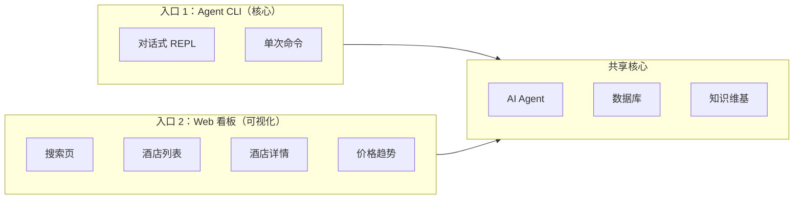
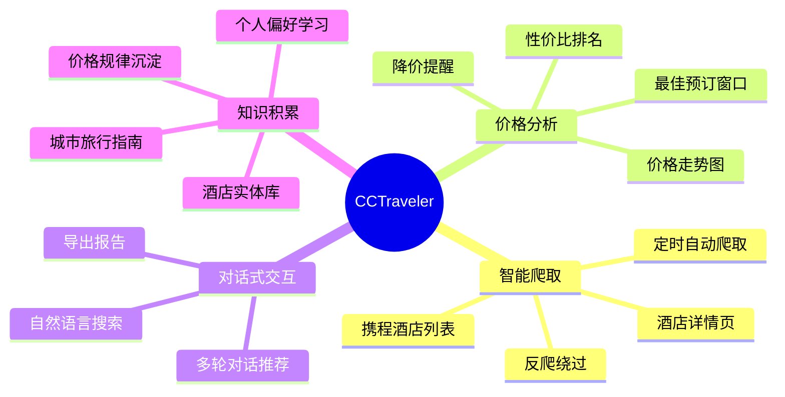
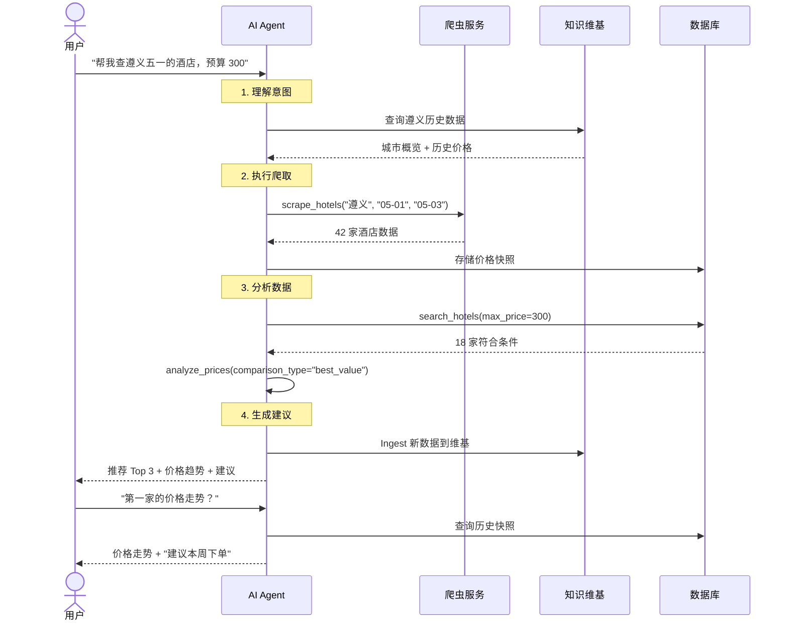
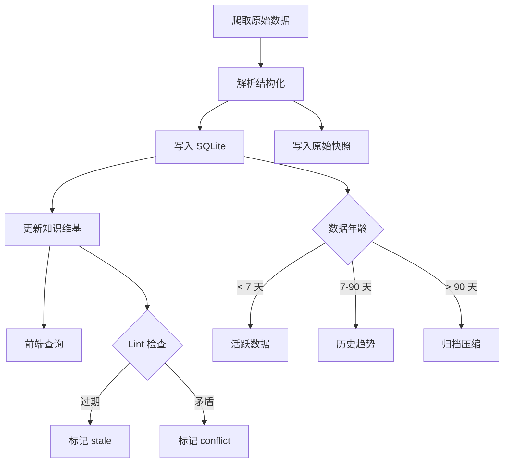
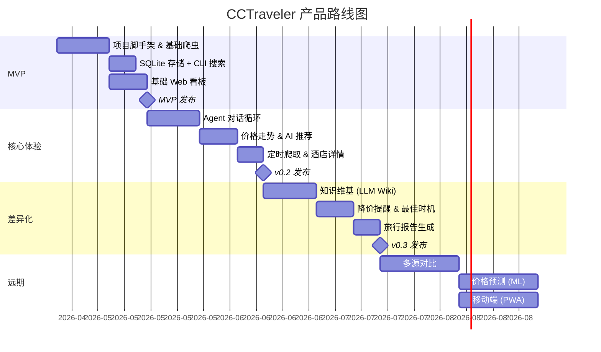

# CCTraveler — 产品设计文档

> 你的 AI 酒店价格情报助手：自动追踪价格、发现最佳时机、积累旅行智慧。

---

## 1. 产品定位

CCTraveler 是一个 **AI 驱动的酒店价格情报平台**，面向有自由行需求的旅行者，通过智能 Agent 自动爬取、分析携程酒店数据，帮助用户在最佳时机以最优价格预订酒店。

### 一句话定义

> **"用 AI 帮你盯酒店价格，像股票分析师一样给你出旅行建议。"**

### 核心价值

| 痛点 | CCTraveler 解决方案 |
|------|-------------------|
| 不知道什么时候订酒店最便宜 | 自动追踪价格波动，发现最佳预订窗口 |
| 手动比较几十家酒店太累 | AI 自动爬取 + 智能筛选 + 性价比排名 |
| 酒店信息分散在各平台 | 统一聚合携程数据，未来扩展美团/飞猪 |
| 每次出行都从零开始研究 | 知识维基积累旅行智慧，越用越懂你 |

---

## 2. 目标用户

### 主要用户画像

```
🎯 主力用户：自由行旅行者
- 年龄：25-40 岁
- 场景：国内周末游 / 小长假 / 年假旅行
- 行为：提前 1-4 周规划，关注性价比
- 痛点：信息过载，不确定何时下单最划算
```

### 使用场景

| 场景 | 用户行为 | CCTraveler 价值 |
|------|---------|----------------|
| **规划中** | "五一去遵义，哪家酒店好？" | 对话式推荐 + 性价比排名 |
| **观望期** | "上次看的那家酒店降价了吗？" | 价格追踪 + 降价提醒 |
| **决策时** | "现在订还是再等等？" | 价格趋势分析 + 最佳预订时机建议 |
| **复盘后** | "帮我记住遵义那家性价比高的酒店" | 知识维基自动积累 |

---

## 3. 产品形态

### 3.1 双入口设计



**CLI（Agent REPL）** — 对话式交互，适合探索和深度分析：
```
$ cctraveler
🏨 CCTraveler v0.1.0 — AI Hotel Price Intelligence

> 帮我查遵义五一期间的酒店，预算 300 以内

正在爬取携程数据... ✓ 获取 42 家酒店
正在分析价格... ✓ 完成

📊 遵义五一酒店推荐（300元以内）:

1. 🥇 遵义美居酒店
   ├─ 大床房 ¥258/晚（原价 ¥388，省 33%）
   ├─ ⭐ 4.6分 (2,340 条评价)
   └─ 📍 汇川区 · 距遵义会议旧址 1.2km

2. 🥈 维也纳酒店(遵义高铁站店)
   ├─ 标准双床房 ¥219/晚
   ├─ ⭐ 4.5分 (1,876 条评价)
   └─ 📍 播州区 · 距高铁站 500m

💡 建议：五一前两周预订平均便宜 25%，
   建议本周内下单锁定价格。

> 把第一家酒店的价格走势给我看看
```

**Web 看板** — 可视化浏览，适合快速对比：

### 3.2 Web 看板页面设计

#### 首页 — 智能搜索

```
┌──────────────────────────────────────────────────────┐
│  🏨 CCTraveler                                       │
│                                                      │
│  ┌────────────────────────────────────────────────┐  │
│  │  🔍 想去哪里？                                  │  │
│  │     遵义                                        │  │
│  │  📅 入住 2026-05-01    📅 退房 2026-05-03      │  │
│  │  👤 2成人 0儿童         ⭐ 不限星级              │  │
│  │               [ 搜索酒店 ]                      │  │
│  └────────────────────────────────────────────────┘  │
│                                                      │
│  📈 最近追踪                                         │
│  ┌──────────┐ ┌──────────┐ ┌──────────┐            │
│  │ 遵义美居  │ │ 维也纳   │ │ 全季酒店  │            │
│  │ ¥258 ↓12%│ │ ¥219 →  │ │ ¥189 ↑5% │            │
│  └──────────┘ └──────────┘ └──────────┘            │
│                                                      │
│  💡 AI 洞察                                          │
│  "遵义五一酒店均价较上月上涨 18%，但仍有 5 家       │
│   酒店维持平日价格，建议优先考虑..."                  │
└──────────────────────────────────────────────────────┘
```

#### 酒店列表 — 筛选与对比

```
┌──────────────────────────────────────────────────────┐
│  遵义 · 2026-05-01 至 05-03 · 42家酒店               │
│                                                      │
│  筛选：[¥100-300] [⭐4+] [含早餐] [距离排序]         │
│                                                      │
│  ┌────────────────────────────────────────────────┐  │
│  │ [📸]  遵义美居酒店                    ¥258/晚  │  │
│  │       ⭐⭐⭐⭐ · 4.6分 · 2,340评                │  │
│  │       汇川区 · 距遵义会议旧址 1.2km             │  │
│  │       🏷️ 含早 · 免费取消 · 有窗                 │  │
│  │       📉 较上周降价 12%                         │  │
│  │       [查看详情]  [加入对比]  [追踪价格]         │  │
│  └────────────────────────────────────────────────┘  │
│  ┌────────────────────────────────────────────────┐  │
│  │ [📸]  维也纳酒店(高铁站店)            ¥219/晚  │  │
│  │       ⭐⭐⭐ · 4.5分 · 1,876评                  │  │
│  │       播州区 · 距高铁站 500m                    │  │
│  │       🏷️ 含早 · 免费WiFi                       │  │
│  │       → 价格稳定                                │  │
│  │       [查看详情]  [加入对比]  [追踪价格]         │  │
│  └────────────────────────────────────────────────┘  │
│                                                      │
│  [1] [2] [3] ... [5]                                │
└──────────────────────────────────────────────────────┘
```

#### 酒店详情 — 价格走势 + 房型

```
┌──────────────────────────────────────────────────────┐
│  遵义美居酒店                                        │
│  ⭐⭐⭐⭐ · 4.6分 · 汇川区                            │
│                                                      │
│  📈 价格走势（近 30 天）                              │
│  ¥400 ┤                                              │
│  ¥350 ┤          ╱╲                                  │
│  ¥300 ┤    ╱╲╱╲╱  ╲                                │
│  ¥258 ┤───╱─────────╲──── 当前价                    │
│  ¥200 ┤╱╱             ╲╲                            │
│  ¥150 ┤                                              │
│       └──┬───┬───┬───┬───┬───┬──                    │
│        3/23 3/30 4/06 4/13 4/20 →                   │
│                                                      │
│  💡 AI 分析：                                        │
│  "该酒店五一价格已从高峰 ¥388 回落至 ¥258，          │
│   接近平日均价 ¥238，是近期较好的预订窗口。"          │
│                                                      │
│  🛏️ 房型                                             │
│  ┌────────────────────────────────────────────────┐  │
│  │ 高级大床房   │ 28m² · 有窗 · 含早  │ ¥258/晚  │  │
│  │ 标准双床房   │ 26m² · 有窗 · 含早  │ ¥278/晚  │  │
│  │ 商务大床房   │ 35m² · 有窗 · 含早  │ ¥338/晚  │  │
│  └────────────────────────────────────────────────┘  │
│                                                      │
│  📍 位置                                             │
│  [地图：距遵义会议旧址 1.2km / 遵义站 3.5km]        │
│                                                      │
│  🔗 去携程预订 →                                     │
└──────────────────────────────────────────────────────┘
```

---

## 4. 核心功能

### 4.1 功能全景



### 4.2 功能优先级

#### P0 — MVP 必备

| 功能 | 描述 | 入口 |
|------|------|------|
| **酒店搜索** | 按城市 + 日期搜索酒店，展示列表 | CLI + Web |
| **价格爬取** | 爬取携程酒店列表页的价格数据 | CLI |
| **基础筛选** | 按价格/星级/评分筛选和排序 | CLI + Web |
| **酒店卡片** | 展示酒店基本信息 + 最低价 | Web |
| **数据导出** | 导出 CSV/JSON 格式的爬取数据 | CLI |

#### P1 — 核心体验

| 功能 | 描述 | 入口 |
|------|------|------|
| **价格走势** | 折线图展示酒店历史价格变化 | Web |
| **AI 推荐** | 基于预算和偏好的智能推荐 | CLI |
| **定时爬取** | 按计划自动爬取指定城市的酒店数据 | CLI |
| **酒店详情** | 爬取并展示房型、设施、评价摘要 | CLI + Web |
| **价格对比** | 多酒店横向价格对比 | Web |

#### P2 — 差异化

| 功能 | 描述 | 入口 |
|------|------|------|
| **降价提醒** | 追踪酒店降价并通知用户 | CLI + 推送 |
| **最佳时机** | 基于历史数据建议最佳预订时间 | CLI |
| **知识维基** | 自动积累城市/酒店/价格规律知识 | 后台自动 |
| **旅行报告** | 生成完整的旅行住宿规划报告 | CLI |

#### P3 — 远期愿景

| 功能 | 描述 |
|------|------|
| **多源对比** | 携程 + 美团 + 飞猪价格交叉对比 |
| **价格预测** | ML 模型预测未来价格走势 |
| **团队协作** | 多人共享旅行规划看板 |
| **移动端** | PWA 或小程序版本 |

---

## 5. 交互设计

### 5.1 Agent 对话模式

Agent 对话遵循 **"理解 → 执行 → 分析 → 建议"** 四步模式：



### 5.2 通知与提醒

```
📱 降价提醒（P2 功能）:

  🏨 遵义美居酒店 价格变动
  ━━━━━━━━━━━━━━━━━━━━━
  5/1-5/3 高级大床房
  ¥288 → ¥238 (-17.4%)
  ━━━━━━━━━━━━━━━━━━━━━
  📉 近 7 天最低价！
  💡 低于历史均价 ¥265

  [去携程预订 →]
```

---

## 6. 数据策略

### 6.1 数据采集节奏

| 场景 | 频率 | 策略 |
|------|------|------|
| 用户主动搜索 | 实时 | 先查缓存（<2h 有效），过期则重新爬取 |
| 已追踪酒店 | 每 6 小时 | 后台定时爬取，记录价格快照 |
| 城市全量更新 | 每周 1 次 | 爬取 Top 100 酒店，更新维基城市页 |
| 节假日密集期 | 每 2 小时 | 节前 2 周加密监控频率 |

### 6.2 数据生命周期



### 6.3 隐私与合规

- **不存储用户个人信息** — 仅存储酒店公开数据
- **爬取频率节制** — 遵守 robots.txt 精神，合理限流
- **数据用途透明** — 仅用于价格分析，不转售
- **本地优先** — 所有数据存储在用户本地，不上传云端

---

## 7. 技术产品映射

| 产品功能 | 技术实现 |
|---------|---------|
| 对话式搜索 | Rust Agent REPL + Anthropic Claude API |
| 酒店数据展示 | Next.js + Tailwind CSS + Recharts |
| 价格走势图 | Recharts 折线图 + SQLite 时序查询 |
| 智能推荐 | LLM 工具调用 (search_hotels + analyze_prices) |
| 定时爬取 | cron-like 调度 + Python Scrapling |
| 知识积累 | LLM Wiki (Ingest/Query/Lint) |
| 降价提醒 | 价格对比触发 + 本地通知 (macOS Notification) |
| 数据导出 | export_report 工具 → CSV/JSON |

---

## 8. 产品指标

### 核心指标

| 指标 | 目标 | 衡量方式 |
|------|------|---------|
| **数据新鲜度** | 追踪酒店价格 <6h 更新 | `avg(now - last_scraped_at)` |
| **推荐准确率** | 用户采纳推荐 >60% | 点击"去携程预订"率 |
| **知识复利率** | Wiki 页面被引用次数 MoM +20% | `query_hit_count / total_queries` |
| **爬取成功率** | >95% 无反爬拦截 | `success_count / total_scrapes` |

### 健康指标

| 指标 | 阈值 | 告警 |
|------|------|------|
| 爬取成功率 | <90% | 反爬策略可能失效 |
| 维基 stale 页面占比 | >30% | Lint 频率需提高 |
| Agent 响应时间 | >30s | 考虑缓存优化 |
| SQLite 数据库大小 | >1GB | 触发归档压缩 |

---

## 9. 产品路线图



---

## 10. 竞品对比

| 维度 | 携程 App | 去哪儿 | 飞猪 | **CCTraveler** |
|------|---------|--------|------|----------------|
| 价格实时性 | 实时 | 实时 | 实时 | 爬取缓存（<6h） |
| 历史价格 | ❌ | ❌ | ❌ | ✅ 完整走势 |
| 价格预测 | ❌ | ❌ | ❌ | ✅ (P3) |
| 跨平台对比 | ❌ | ❌ | ❌ | ✅ (P3) |
| AI 推荐 | 基于算法 | 基于算法 | 基于算法 | 对话式 AI |
| 知识积累 | ❌ | ❌ | ❌ | ✅ LLM Wiki |
| 数据所有权 | 平台持有 | 平台持有 | 平台持有 | 用户本地 |
| 降价提醒 | 有限 | 有限 | 有限 | ✅ 智能触发 |

### 差异化优势

1. **历史价格透明** — OTA 平台不展示历史价格，CCTraveler 让价格走势一目了然
2. **对话式分析** — 不只是搜索+筛选，而是和 AI 对话获取深度分析和建议
3. **知识复利** — 越用越聪明，积累城市/酒店/价格规律，下次推荐更精准
4. **数据自主** — 所有数据存在用户本地，不被平台算法操控

---

## 11. 风险与应对

| 风险 | 影响 | 应对策略 |
|------|------|---------|
| 携程反爬升级 | 数据无法获取 | Scrapling 持续更新 + 备用 Selenium 方案 |
| 法律合规风险 | 被要求停止爬取 | 仅爬取公开数据、合理频率、不商用 |
| LLM API 成本 | 对话越多成本越高 | 本地缓存 + 维基减少重复推导 |
| 数据准确性 | 爬取数据与实际不符 | Lint 审计 + 多次爬取交叉验证 |

---

## 参考文献

- [项目架构文档 (EN)](./architecture.md)
- [项目架构文档 (中文)](./architecture-zh.md)
- [ultraworkers/claw-code](https://github.com/ultraworkers/claw-code) — Agent 架构参考
- [Karpathy's LLM Wiki](https://gist.github.com/karpathy/442a6bf555914893e9891c11519de94f) — 知识管理方法论
- [D4Vinci/Scrapling](https://github.com/D4Vinci/Scrapling) — 爬虫框架
- [携程酒店](https://hotels.ctrip.com/) — 数据来源
